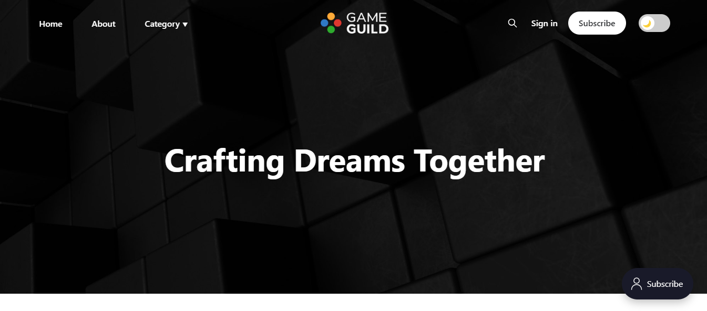

)
)

# Game Guild Platform

We are a **game dev** community.
Our main goal is to revolutionize the way game developers:
- **Collaborate**: with others in workshops and lectures online and in person.
- **Learn**: learn from mentors and other more experienced developers.
- **Monetize**: their creations.

Our platform will provide a space for developers to showcase their games, connect with other creators, and access resources for skill development. Users can discover new games, playtest them, and support their favorite developers through in-game purchases or donations.



## How to install setup

### Setup Windows/MacOS:

1. Install Docker;
2. install Node.js. I am using version 18, probably other versions will work as well;
3. Start the database with the command line on the root of the repo `docker-compose up -d adminer`;
4. Ask a teammate the `.env` files;
5. run `npm install` on the root of the repo to install the dependencies;
6. run `npm run start:both` on the root of the repo to start both front and back-end;

### Setup GNU/Linux:

1. Install Docker, view: https://docs.docker.com/engine/install/

2. Install Node.js, version 20. Recommend use NVM to version a correct nodejs version for this project:

```bash
# installs nvm (Node Version Manager)
curl -o- https://raw.githubusercontent.com/nvm-sh/nvm/v0.40.0/install.sh | bash
# download and install Node.js (you may need to restart the terminal)
nvm install 20
# verifies the right Node.js version is in the environment
node -v # should print `v20.18.1`
# verifies the right npm version is in the environment
npm -v # should print `10.8.2`
```

3. Start the database with the command line on the root of the repo `sudo docker compose up -d adminer`;
4. Ask a teammate the `.env` files;
5. Run `npm install` on the root of the repo to install the dependencies;

6. Two ways to run:

- Run `npm run start:both` on the root of the repo to start both front and back-end; or

- Run `npm run start:both` to start back-end and in new terminal, run `npm run dev:web` to start front-end;

## How You Can Contribute
We’re actively seeking contributors to help us improve and expand the platform. Here’s how you can get involved:
- **Report Issues**: Found a bug or have a suggestion? Open an issue!
- **Contribute Code**: Take on issues labeled good first issue.
- **Share the Project**: Star the repo and spread the word to fellow developers!


## Why Star This Project?
By starring this repository, you:
- Show support for the project.
- Help increase visibility, attracting more contributors and collaborators.
- Join a growing community shaping the future of game development.

<div class="social-links">
  <style>
    #socialicon img{
      width: 64px;
    }
    .social-links {
      display: grid;
      grid-template-columns: repeat(3, 1fr);
      text-align: center;
      margin-top: 20px;
    }
  </style>
  <!-- YouTube -->
  <a id="socialicon" href="https://www.youtube.com/@AwesomeGamedevGuild" target="_blank" style="text-decoration: none; margin: 0 15px;">
    
  </a>
  <!-- WhatsApp -->
  <a id="socialicon" href="https://chat.whatsapp.com/CAboWKtosP673f9EkzxKNb" target="_blank" style="text-decoration: none; margin: 0 15px;">
    
  </a>
  <!-- Instagram -->
  <a id="socialicon" href="" target="_blank" style="text-decoration: none; margin: 0 15px;">
    
  </a>
  <!-- Facebook -->
  <!-- <a id="socialicon" href="https://x.com/GameGuildDev" target="_blank" style="text-decoration: none; margin: 0 15px;">
    
  </a> -->
  <!-- LinkedIn -->
  <!-- <a id="socialicon" href="https://x.com/GameGuildDev" target="_blank" style="text-decoration: none; margin: 0 15px;">
    
  </a> -->
  <!-- X -->
  <a id="socialicon" href="https://x.com/GameGuildDev" target="_blank" style="text-decoration: none; margin: 0 15px;">
    
  </a>
  <!-- Threads -->
  <!-- <a id="socialicon" href="" target="_blank" style="text-decoration: none; margin: 0 15px;">
    
  </a> -->
  <!-- Discord -->
  <a id="socialicon" href="https://discord.com/invite/9CdJeQ2XKB?ref=gameguild.gg" target="_blank" style="text-decoration: none; margin: 0 15px;">
    
  </a>
  <!-- BlueSky -->
  <a id="socialicon" href="https://bsky.app/profile/gameguild.bsky.social" target="_blank" style="text-decoration: none; margin: 0 15px;">
    
  </a>
  <!-- TikTok -->
  <a id="socialicon" href="https://www.tiktok.com/@awesomegameguild" target="_blank" style="text-decoration: none; margin: 0 15px;">
    
  </a>
  <!-- Patreon -->
  <a id="socialicon" href="https://mastodon.social/@gameguild" target="_blank" style="text-decoration: none; margin: 0 15px;">
    
  </a>
  <!-- Mastodon -->
  <a id="socialicon" href="https://mastodon.social/@gameguild" target="_blank" style="text-decoration: none; margin: 0 15px;">
    
  </a>
  <!-- Twitch -->
  <a id="socialicon" href="https://www.twitch.tv/awesomegamedevguild" target="_blank" style="text-decoration: none; margin: 0 15px;">
    
  </a>
  <!-- Itch.io -->
  <a id="socialicon" href="http://gameguild.itch.io/" target="_blank" style="text-decoration: none; margin: 0 15px;">
    
  </a>
  <!-- GameJolt -->
  <a id="socialicon" href="https://gamejolt.com/@GameGuild" target="_blank" style="text-decoration: none; margin: 0 15px;">
    
  </a>
</div>
Icons by [Icons8](https://icons8.com/)

## Star History

[](https://star-history.com/#gameguild-gg/website&Date)

## Gource

[](https://gameguild-gg.github.io/website/gource.mp4)

## License

This project is available under a dual-license model:

1. **Open Source License:** [GNU AGPL v3.0](./LICENSE)
    - For non-commercial, open-source use or commercial with less than 1000 users.
    - Must comply with AGPL terms, including providing source code for modifications.

2. **Commercial License:** [Commercial License](./COMMERCIAL_LICENSE.md)
    - For commercial use exceeding 1000 users.
    - Contact us for terms on discord.
 
