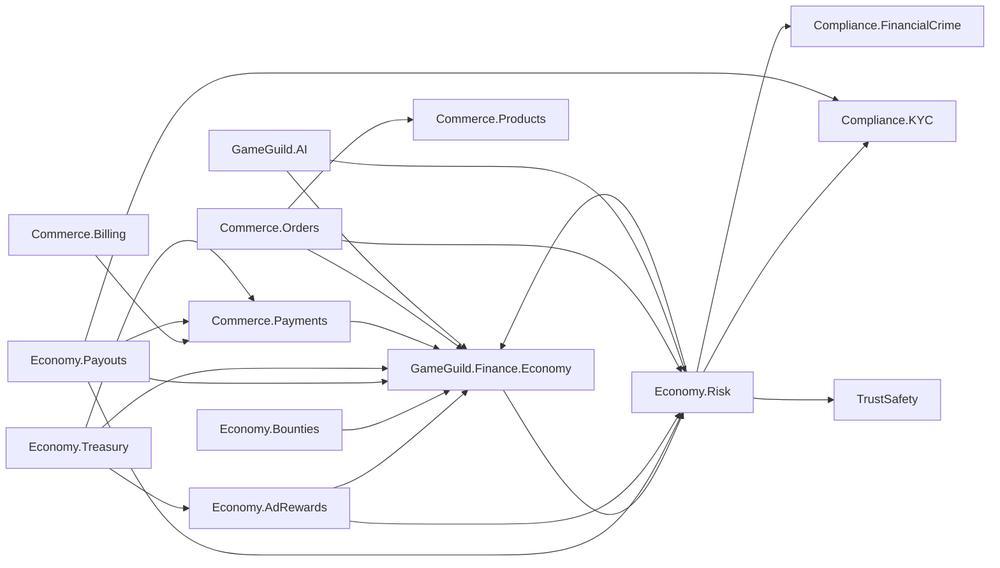

# Dual-Currency Economy Architecture

Date: 2026-07-16
Status: Proposed for stakeholder review
Source: `docs/papers/dual-currency-economy-whitepaper.md`
Scope: Internal hard coins, internal soft coins, ad rewards, marketplace settlement, escrow, payouts, reserves, and custody reconciliation

## Purpose

This document turns the dual-currency whitepaper into a technical architecture for the GameGuild modular monolith. It defines module boundaries, ownership, data invariants, transaction boundaries, integration contracts, and production gates.

The source whitepaper remains the product and economic intent. This architecture refines the parts that are deliberately left open in the paper, especially schema design, provider finality, provenance allocation, reserve units, authorization, and concurrency. The stakeholder-approved locked decisions in this document are normative when an earlier whitepaper example differs, including the fixed `100,000 SC/USD` parity.

## Relationship To Existing GameGuild Tokens

The dual-currency economy is separate from the legacy `GGG` governance-token material in `docs/papers/whitepaper.md` and `docs/papers/tokenomics.md`.

| Asset     | Nature                                                       | On chain    | Cash redeemable                            | Purpose                                                          |
| --------- | ------------------------------------------------------------ | ----------- | ------------------------------------------ | ---------------------------------------------------------------- |
| Hard coin | Internal stored-value unit; `100 HC = USD 1.00`              | No          | Earned hard only, through approved payouts | Marketplace settlement and creator earnings                      |
| Soft coin | Fixed-value internal service credit; `100,000 SC = USD 1.00` | No          | Never                                      | Ad rewards, AI services, peer activity, and low-stakes purchases |
| GGG       | Separate governance concept                                  | Potentially | Outside this architecture                  | Governance and voting                                            |

No API, table, conversion, or user-facing projection may conflate these assets.

## Locked Decisions

1. `100 hard coins = USD 1.00` and `100,000 soft coins = USD 1.00`.
2. The fixed reference conversion is `1 HC = 1,000 SC`. A configured conversion fee is posted separately and never changes the principal parity.
3. Hard and soft quantities are represented as signed integer coin units. One SC is already the smallest supported soft unit (`USD 0.00001`); lots, allocations, postings, and projections never use floating point.
4. Soft parity defines internal purchasing value and treasury backing. It does not create a cash-redemption right.
5. Soft reward issuance uses a versioned, conservative USD revenue estimate converted at exactly `100,000 SC/USD`. Actual ad revenue is reconciled later by batch.
6. A soft reward that passed verification and was posted is final. Reconciliation never edits or claws back that reward.
7. Soft coins never convert to hard coins or cash.
8. Only earned hard-coin lots that are mature and not held may be paid out.
9. Any spend, conversion, transfer, or escrow deposit consumes only confirmed, usable lots in FIFO order by `confirmed_at`, then stable journal sequence. Pending value is never selectable.
10. Every value movement is represented by an atomic, balanced, versioned posting template. Corrections are new reversing postings.
11. Economy journal entries are append-only and hash-chained. They do not inherit the mutable or soft-deletable base entity.
12. Reserve accounting is a treasury projection over external assets and internal liabilities. A reserve is not credited as a second spendable admin-wallet claim.
13. The legacy `UserWallet`, `WalletTransaction`, and `FinancialLedgerEntry` models are not the source of truth for this economy.
14. Every inbound credit has an immutable source stamp. A new earned-hard lot reaches its minimum maturity exactly 120 days after its authoritative `confirmed_at`; no accelerated-release path may make it withdrawable earlier, while active fraud/dispute/legal holds may keep it blocked longer.
15. An observed but unconfirmed deposit is visible in `total` and `pendingConfirmation` as a nonmonetary claim projection, but no coin is minted and no credit lot exists before authoritative confirmation. Confirmation appends evidence and atomically mints the confirmed lot; failure or expiry appends terminal evidence without a monetary posting.
16. A scalar balance is never monetary truth. Every confirmed unit remains attributable to a source-stamped credit lot; partial debits create immutable fractional allocations, and reversals operate on those exact fragments through new postings.
17. Coins are economically fungible within the same currency and eligibility class: one eligible unit has the same nominal value as another, and users never choose source lots. They are not anonymous bearer tokens. The ledger preserves root-source and descendant-fragment lineage for fraud, maturity, refund, dispute, and payout enforcement.
18. A provider-funded mint that is later reversed triggers a provenance unwind. Every surviving descendant fragment is frozen and reversed; any fragment already consumed, externally redeemed, or otherwise irrecoverable becomes an explicit debt, receivable, or policy-versioned platform loss. History is never deleted or rewritten.

These decisions are the normative launch contract. Parity, confirmed-only FIFO spending, the 120-day minimum maturity, and pending-claim isolation are not runtime policy switches.

Reference examples:

| USD reference | Hard coin |    Soft coin |
| ------------: | --------: | -----------: |
|      USD 0.01 |      1 HC |     1,000 SC |
|      USD 1.00 |    100 HC |   100,000 SC |
|     USD 10.00 |  1,000 HC | 1,000,000 SC |

## Goals

- Preserve the one-way hard-to-soft rule at the database and application layers.
- Preserve both fixed parities and the exact `1 HC = 1,000 SC` principal relationship at the database and application layers.
- Preserve hard-coin provenance through spending, escrow, reclaim, refund, and payout.
- Preserve lot identity, split/merge lineage, and partial-allocation ancestry even when the UI displays one aggregate balance.
- Trace every inbound credit to an immutable, confirmed source stamp and enforce its 120-day earned-hard maturity.
- Show observed deposits immediately as pending claims without minting coins or allowing them to fund any transaction before authoritative confirmation.
- Prevent double spend and replay under concurrent requests and provider retries.
- Separate provider operations from internal financial truth.
- Reconcile estimated ad revenue without changing previously granted rewards.
- Support marketplace purchases in hard, soft, either, or a fixed atomic mix.
- Expose total, pending, held, available, and withdrawable projections without implying that an aggregate is monetary truth.
- Make every administrative adjustment attributable, reviewable, and reversible through offsetting entries.
- Keep work decomposable into small branches and independently owned modules.

## Non-Goals

- Implementing an on-chain token or cryptocurrency.
- Implementing GGG governance or DAO economics.
- Selecting final fee percentages, fraud thresholds, ad networks, or KYC providers.
- Enabling cash-out before legal review and Stripe Connect approval.
- Guaranteeing that web ad fraud can be eliminated. The goal is bounded, detectable financial exposure.
- Migrating legacy wallet balances without an explicit provenance-classification decision.

## Architecture Options

### Option A: Extend `GameGuild.Commerce.Payments`

This would reuse `UserWallet` and `FinancialLedgerEntry` directly.

Rejected because the current wallet stores a mutable balance, supports one three-character currency per user, and has no lots, holds, maturity, hash chain, or immutable posting group. Payments also owns provider concerns, which would couple Stripe behavior to internal ledger truth.

### Option B: One Large `GameGuild.Finance.Economy` Module

This provides one clear source of truth and the fewest project references.

It is viable for a small first prototype, but it creates one large ownership surface across ledger, ads, payouts, bounties, and treasury. That prevents safe parallel work and increases merge and migration conflicts.

### Option C: Economy Core With Focused Capability Modules

Recommended.

One foundational module owns financial truth. Focused modules own distinct business lifecycles and can only move value through typed core commands. Existing commerce and provider modules remain responsible for their current domains.

This keeps the ledger centralized without turning every economy feature into one code package.

## Module And Package Design

### New Modules

| Module                                | Owns                                                                                                                                                                                                                           | Must never own                                                                                                      |
| ------------------------------------- | ------------------------------------------------------------------------------------------------------------------------------------------------------------------------------------------------------------------------------ | ------------------------------------------------------------------------------------------------------------------- |
| `GameGuild.Finance.Economy`                   | Wallet identities, accounts, posting groups, journal entries, credit lots, fragment lineage, projections, holds, authoritative reserve head/allocation locks, fee/rate policy versions, idempotent posting, chain verification | Stripe SDK calls, ad playback, product catalog, orders, KYC provider calls, risk scoring                            |
| `GameGuild.Finance.Economy.Risk`              | Versioned risk policies, transaction risk decisions, entity graph references, velocity/exposure limits, fraud holds, review queues, and risk-decision evidence                                                                 | Journal mutation, monetary balances, KYC document storage, sanctions screening ownership                            |
| `GameGuild.Finance.Economy.AdRewards`         | Ad sessions, signed reward claims, network yield policies, reward quotes, provider proof checks, revenue batches, reconciliation                                                                                               | Direct balance mutation, Stripe payouts, product fulfillment, global risk-policy ownership                          |
| `GameGuild.Finance.Economy.Bounties`          | Bounty lifecycle, eligibility snapshots, escrow positions, claim and reclaim decisions                                                                                                                                         | Generic wallet mutation, product checkout, KYC                                                                      |
| `GameGuild.Finance.Economy.Payouts`           | Payout requests, earned-lot reservation, connected-account status, payout lifecycle, dispute-to-hold orchestration, seller debt                                                                                                | Provider webhook ingress, journal table mutation outside core posting contracts, KYC/sanctions policy ownership     |
| `GameGuild.Finance.Economy.Treasury`          | External-asset observations, reserve calculations proposed to Core, custody reconciliation, admin revenue maturity, monthly withdrawal runs, variance and shortfall reporting                                                  | User checkout, mutable wallet balances, ad playback verification, direct mutation of the authoritative reserve head |
| `GameGuild.Compliance.FinancialCrime` | KYC status aggregation, sanctions/PEP/adverse-media screening status, financial-crime monitoring cases, SAR/STR workflow references, and compliance hold inputs                                                                | Balance calculation, journal mutation, product trust/safety enforcement                                             |
| `GameGuild.TrustSafety`               | Platform policy infractions, abuse reports, marketplace/project enforcement, content/product risk cases, and nonfinancial account restrictions                                                                                 | Ledger mutation, financial-crime legal determinations, reserve calculations                                         |

### Physical Package Map

```text
apps/api/Source/Modules/
  GameGuild.Finance.Economy/
    Accounts/             wallet accounts and account-purpose contracts
    Journal/              posting templates, entries, lots, fragment lineage, chain
    Policies/             fixed parity, fees, limits, maturity, holds
    Projections/          balance/lot reads and recomputation
    Reserves/             authoritative reserve head, asset-allocation lock, epochs
    Persistence/          EF mappings and constrained writer integration
    Reconciliation/       chain, projection, and anchor verification
  GameGuild.Finance.Economy.Risk/
    Decisions/            versioned transaction risk decisions and reason codes
    EntityGraph/          HMAC-tokenized relationship edges and exposure clusters
    Limits/               velocity, aggregate, source-root, destination, and pair limits
    Reviews/              risk holds, case links, appeals, and decision evidence
  GameGuild.Finance.Economy.AdRewards/
  GameGuild.Finance.Economy.Bounties/
  GameGuild.Finance.Economy.Payouts/
  GameGuild.Finance.Economy.Treasury/
  GameGuild.Compliance.FinancialCrime/
  GameGuild.TrustSafety/

apps/api/tests/
  GameGuild.Finance.Economy.UnitTests/
  GameGuild.Finance.Economy.IntegrationTests/
  GameGuild.Finance.Economy.Risk.UnitTests/
  GameGuild.Finance.Economy.Risk.IntegrationTests/
  GameGuild.Finance.Economy.AdRewards.UnitTests/
  GameGuild.Finance.Economy.Bounties.UnitTests/
  GameGuild.Finance.Economy.Payouts.UnitTests/
  GameGuild.Finance.Economy.Treasury.UnitTests/
  GameGuild.Compliance.FinancialCrime.UnitTests/
  GameGuild.TrustSafety.UnitTests/
```

Each project exposes a narrow `Contracts` namespace and keeps persistence internal. Capability modules submit typed requests to the core; they never reference core EF configurations, repositories, or journal entities.

### Existing Modules

| Module                        | Economy responsibility                                                                                                                       |
| ----------------------------- | -------------------------------------------------------------------------------------------------------------------------------------------- |
| `GameGuild.Commerce.Payments` | Stripe PaymentIntent, refund, Connect account, transfer, and payout adapters. It reports provider facts and requests typed economy postings. |
| `GameGuild.Commerce.Billing`  | Signature verification, durable webhook inbox, normalized provider events, retries, and provider reconciliation triggers.                    |
| `GameGuild.Commerce.Products` | Product prices and accepted-currency policy: hard-only, soft-only, either, or fixed mix.                                                     |
| `GameGuild.Commerce.Orders`   | Checkout intent, immutable price snapshot, settlement orchestration, refund decision, and entitlement coordination.                          |
| `GameGuild.AI`                | Exact provider usage and cost facts. It requests an economy authorization/charge before or atomically with billable work.                    |
| `GameGuild.Compliance.KYC`    | Verified identity and risk status consumed by payout eligibility. It does not compute balances.                                              |
| `GameGuild.SharedKernel`      | CQRS abstractions, authorization, validation, clock, domain-event and observability primitives. It contains no economy policy.               |

### Dependency Direction



The core never references Ads, Bounties, Payouts, Treasury, Products, Orders, Payments, Billing, AI, KYC provider adapters, or product Trust/Safety services. Leaf modules depend inward through public contracts. The one intentional cross-boundary is the protected-operation risk contract: Core requires a current `RiskDecisionId` for protected commands and verifies its immutable decision snapshot, but Risk cannot write journal state.

## Core Domain Model

### Value Types

| Type                 | Representation                                    | Rule                                                                                                                                             |
| -------------------- | ------------------------------------------------- | ------------------------------------------------------------------------------------------------------------------------------------------------ |
| `HardCoinAmount`     | signed `long`                                     | `100 HC = USD 1.00`; checked integer arithmetic only                                                                                             |
| `SoftCoinAmount`     | signed `long`                                     | `100,000 SC = USD 1.00`; one SC is the indivisible base unit and is never cash redeemable                                                        |
| `UsdNanoAmount`      | signed `long` with checked `Int128` intermediates | Internal rate calculation only; `1,000,000,000` nanos equals USD 1.00 and is never a wallet balance                                              |
| `CurrencyKind`       | explicit enum                                     | `Hard`, `Soft`                                                                                                                                   |
| `HardCoinProvenance` | explicit enum                                     | `Purchased`, `Earned`                                                                                                                            |
| `SoftCoinProvenance` | explicit enum                                     | `AdReward`, `HardConversion`, `SystemBackedGrant`, `EarnedTransfer`                                                                              |
| `CreditSourceKind`   | explicit stable enum                              | Monetary source tag such as Stripe top-up, order sale, bounty claim, ad reward, hard conversion, system grant, refund restoration, or adjustment |
| `AccountCode`        | explicit enum/value                               | User, escrow, fee revenue, issuance/redemption, burn, debt, and other system accounts                                                            |
| `PostingReference`   | type plus stable ID                               | Connects a posting to a provider or domain event                                                                                                 |
| `SourceStamp`        | opaque immutable value/reference                  | Source kind, provenance, internal source ID, provider-fact mapping, confirmation kind/time, policy version, and canonical hash                   |
| `IdempotencyKey`     | bounded string/value                              | Unique within an operation scope                                                                                                                 |

Provenance and account purpose are different dimensions. `Purchased` and `Earned` describe origin. `FeeRevenue`, `Reserve`, and `PayoutClearing` describe accounting purpose. They must not share one `source_tag` field.

### Tables Owned By `GameGuild.Finance.Economy`

All names below are logical. Final EF names follow project conventions.

| Table                                 | Purpose                                                                                                                                          | Mutability                                                     |
| ------------------------------------- | ------------------------------------------------------------------------------------------------------------------------------------------------ | -------------------------------------------------------------- |
| `economy_wallets`                     | Owner identity and wallet lifecycle                                                                                                              | Status transitions only                                        |
| `economy_accounts`                    | Currency, provenance, and account-code partitions                                                                                                | Configuration/status only                                      |
| `economy_posting_groups`              | One atomic business transaction, immutable posting-template type/version, authorization context, and idempotency anchor                          | Append-only                                                    |
| `economy_journal_entries`             | Ordered signed postings                                                                                                                          | Append-only                                                    |
| `economy_source_stamps`               | Immutable source/provenance tag, opaque source/provider fact, observed time, policy version, and hash for every funding intent or inbound credit | Append-only                                                    |
| `economy_source_stamp_events`         | Observed, confirmed, failed, expired, disputed, and reversed evidence for a source stamp                                                         | Append-only                                                    |
| `economy_provider_fact_allocations`   | Unique provider/environment/account/object/monetary-leg binding and cumulative confirmed/refunded/disputed amount consumption                    | Append-only monetary events plus guarded cumulative projection |
| `economy_credit_lots`                 | Immutable credit amount, source-stamp ID, `credited_at`, `confirmed_at`, `matures_at`, and cash-out eligibility                                  | Append-only                                                    |
| `economy_entry_allocations`           | Debit-to-credit-lot provenance consumption                                                                                                       | Append-only                                                    |
| `economy_lot_lineage_edges`           | Exact integer parent-fragment to child-lot mapping for splits, merges, fees, escrow, transfers, and settlement                                   | Append-only                                                    |
| `economy_fragment_root_ranges`        | Immutable root ID plus half-open trace-unit intervals carried through each allocation/output, including mixed-root lots                          | Append-only                                                    |
| `economy_root_reversal_states`        | Per-root reversal epoch, cumulative provider amount, targeted intervals, and active/frozen/completed state                                       | Guarded transition only                                        |
| `economy_dispatch_snapshots`          | Canonical payout/admin-withdrawal eligibility state and hash bound to exact fragments and operation versions                                     | Append-only                                                    |
| `economy_external_anchors`            | KMS signature and WORM reference covering chain head plus optional dispatch-snapshot hash                                                        | Append-only                                                    |
| `economy_chain_head`                  | Singleton current sequence/hash                                                                                                                  | Mutable under row lock                                         |
| `economy_pending_funding_projections` | Observed external funding claims shown before confirmation; never a coin account or spend authority                                              | Rebuildable from source evidence                               |
| `economy_balance_projections`         | Fast aggregate confirmed, held, available, and withdrawable reads plus a joined pending-claim view; never authoritative monetary state           | Rebuildable cache                                              |
| `economy_credit_lot_projections`      | Remaining and reserved amount per credit lot                                                                                                     | Rebuildable cache                                              |
| `economy_holds`                       | Administrative encumbrance state                                                                                                                 | Controlled state machine                                       |
| `economy_hold_events`                 | Hold audit history                                                                                                                               | Append-only                                                    |
| `economy_policy_versions`             | Versioned fees, ad-yield inputs, service prices/margins, limits, and maturity rules; fixed parity is not policy-configurable                     | Append-only versions                                           |
| `economy_idempotency_records`         | Exactly-once command result and state                                                                                                            | Controlled state machine                                       |
| `economy_outbox_messages`             | Events committed with postings                                                                                                                   | Append-only, delivery state mutable                            |
| `economy_reserve_heads`               | Core-validated active reserve version, coverage state, asset-allocation lock, and authorization epoch                                            | Guarded transition only                                        |
| `economy_reserve_asset_allocations`   | Exclusive assignment of eligible external assets to hard or soft backing                                                                         | Guarded transition only                                        |

### Posting Group Invariant

A posting group contains two or more entries and must sum to zero independently for every currency represented:

```text
for each currency in posting_group:
    SUM(entry.amount_minor) == 0
```

Cross-currency conversion is one business operation containing two balanced currency legs. Hard and soft values are never summed against each other.

Balance alone is insufficient. Every group also stores an immutable `operation_type` and `template_version`. The database posting interface validates the exact account cardinality, currencies, signs, provenance, payout eligibility, issuance authority, policy version, limits, and any cross-currency relationship required by that template. A balanced but unauthorized shape is rejected.

### Canonical Posting Templates

`+` increases the account claim and `-` decreases it.

| Event                                 | Entries                                                                                                                                                                                                                                                                                                          |
| ------------------------------------- | ---------------------------------------------------------------------------------------------------------------------------------------------------------------------------------------------------------------------------------------------------------------------------------------------------------------- |
| Deposit observed                      | No monetary entries. Create the immutable funding source stamp, append `Observed` evidence, and update the rebuildable pending-funding claim projection                                                                                                                                                          |
| Deposit confirmed / mint              | Buyer confirmed purchased-hard `+H`; hard issuance `-H`; append authoritative `Confirmed` evidence and create the root credit lot atomically                                                                                                                                                                     |
| Deposit failed/expired                | No monetary entries. Append terminal evidence and remove the claim from the rebuilt pending-funding projection                                                                                                                                                                                                   |
| Provider top-up refund/chargeback     | Reverse every recoverable descendant using balanced per-currency retirement templates; route unavailable root-equivalent portions to responsible-party debt/receivable or the snapshotted platform-loss account; enforce cumulative provider amount and source lineage without reminting an already retired root |
| Hard marketplace purchase             | Buyer hard lots `-H`; seller earned-hard `+(H-F)`; platform fee `+F`                                                                                                                                                                                                                                             |
| Soft marketplace purchase             | Buyer soft lots `-S`; seller earned-soft `+(S-F)`; platform fee/burn account `+F`, according to the fee policy                                                                                                                                                                                                   |
| Fixed mix purchase                    | The complete hard template and complete soft template in one database transaction; both succeed or both fail                                                                                                                                                                                                     |
| Ad reward                             | Student ad-reward soft `+S`; ad-backed soft issuance `-S`                                                                                                                                                                                                                                                        |
| Hard-to-soft conversion               | User hard `-(H+F)`; hard issuance/redemption `+H`; fee account `+F`; user soft `+S`; soft issuance `-S`, where principal `S = H * 1,000`; the same transaction reclassifies backing from hard to soft reserve                                                                                                    |
| System-backed soft grant              | Platform hard `-H`; hard issuance/redemption `+H`; user soft `+S`; system-backed soft issuance `-S`, where `S = H * 1,000`; the same transaction consumes an approved grant budget and reclassifies backing to soft reserve                                                                                      |
| Soft burn for AI                      | User soft `-S`; soft burn/service-consumption account `+S`                                                                                                                                                                                                                                                       |
| Bounty claim                          | Escrow `-A`; claimant earned account `+A`, less any separately posted configured fee                                                                                                                                                                                                                             |
| Bounty reclaim                        | Escrow `-A`; poster original provenance `+(A-F)`; reclaim fee `+F`                                                                                                                                                                                                                                               |
| Payout reservation/dispatch           | No monetary entries. Reserve the oldest eligible earned-hard fragments, persist the fencing/kill-switch epoch, and atomically claim the provider-dispatch command                                                                                                                                                |
| Payout provider success / burn        | User earned-hard `-H`; hard redemption/issuance `+H`; retire the exact reserved fragments only after authoritative provider success                                                                                                                                                                              |
| Payout provider failure               | No monetary entries. Release the same fragment reservations; lot identity, provenance, confirmation time, and maturity never change                                                                                                                                                                              |
| Admin withdrawal reservation/dispatch | No monetary entries. Reserve the oldest eligible platform-fee fragments and persist the approved run plus fencing version                                                                                                                                                                                        |
| Admin withdrawal success / burn       | Platform fee hard `-H`; hard redemption/issuance `+H`; retire the exact reserved fragments after authoritative provider success and record the company cash transfer                                                                                                                                             |
| Admin withdrawal failure              | No monetary entries. Release the same reserved platform-fee fragments without creating a new lot or maturity clock                                                                                                                                                                                               |
| Refund                                | New reversing group restores buyer lot provenance and debits seller proceeds, platform fee, debt, or loss accounts according to the snapshotted refund policy                                                                                                                                                    |

Every template records the effective policy version and all variable fees/rates applied. Fixed parity is a domain/schema invariant, not a mutable policy. A later policy change cannot reinterpret a historical transaction.

For durable bounty reclaims, every returned fragment restores the poster's original provenance,
confirmation timestamp, maturity timestamp, cash-out eligibility, and root-trace ranges. A configured
hard-coin reclaim fee is recorded in `FeeRevenueHard`; a configured soft-coin reclaim fee is an explicit
burn to `SoftCoinReserve`. Both paths preserve the exact source ranges on immutable debit allocations.
The configured rate can be zero and remains policy-versioned; changing a future rate never rewrites a
historical reclaim.

User conversions and system-backed grants accept an integer hard principal, so the resulting grant is always an exact multiple of `1,000 SC`. Ad-backed rewards may use individual SC units because their backing source is estimated ad revenue rather than a hard-coin debit.

## Fungibility, Credit Lots, And Provenance

Money is never represented by a wallet balance row. Monetary state is the collection of unconsumed, source-stamped fragments and their append-only history. A displayed balance is only a query projection that sums the fragments currently attributable to the wallet.

Coins are fungible for valuation and ordinary spending, not for audit. Within a currency and operation-eligibility class, the holder experiences one interchangeable quantity. Internally, every confirmed credit creates a logical lot. A debit creates one or more immutable allocation records for exact integer fragments of existing lots. Each resulting recipient, fee, escrow, conversion, or derived-credit lot receives lineage edges that conserve those input fragments across every output. Partial use never destroys or retags the source; its remaining quantity is derived from the original credit minus its allocation history.

When several input lots fund several outputs, the writer maps inputs in canonical FIFO order to outputs in canonical entry order. For every currency in a posting group, allocated parent fragments must equal derived output fragments plus explicitly retired fragments. A hard-to-soft edge additionally records the fixed principal mapping `1 HC = 1,000 SC`; a privileged reversal may retire the traced soft descendants without creating a user-accessible soft-to-hard conversion. This deterministic split/merge rule makes every current leaf fragment traceable to one or more root mints without asking users to manage individual tokens.

Each root mint defines an immutable ordered trace interval. A hard root of `H HC` owns `[0, H * 1,000)` trace quanta; hard movements consume aligned blocks of `1,000`, while conversion maps them directly to `H * 1,000 SC` so individual soft descendants remain representable. A native soft root of `S SC` owns `[0, S)`. Splits partition ranges from lowest offset upward; merges retain an ordered set of `(root_id, start, end)` slices rather than erasing ancestry. Unallocated ranges remain with the parent lot projection.

Launch allocation policy:

1. Pending claims never enter the lot queue. Exclude every failed, expired, held, reserved, disputed, frozen, or otherwise ineligible confirmed fragment.
2. FIFO across all remaining eligible lots by `confirmed_at`, then stable journal sequence. Provenance does not reorder the queue.
3. Payouts may allocate only mature, unheld earned-hard lots.
4. Escrow preserves the exact allocations deposited.
5. Reclaim, refund, failure, and reversal reference the original allocation and lineage graph. They restore or retire exact fragments through new postings.
6. A lot cannot be over-allocated. Posting locks affected lot projections in canonical order.
7. Withdrawal reserves and, after provider confirmation, burns the oldest eligible mature earned-hard fragments first.

Every inbound credit references exactly one immutable source stamp. Required stamp fields are:

- source kind tag and independent hard/soft provenance
- opaque internal source ID, source-leg ID, and, where external, opaque provider-fact mapping ID
- observed time plus append-only evidence events carrying confirmation kind and authoritative `confirmed_at` when available
- actor/tenant context, posting reference, and policy version
- canonical payload hash and journal sequence

The unique internal identity is `(source_kind, internal_source_id, source_leg_id)`. For external value, `(provider, environment, connected_account, provider_object, provider_monetary_leg)` is also globally unique, and cumulative confirmed credits may never exceed the provider-confirmed amount. The source tag describes how value entered; provenance describes whether hard is purchased/earned or which soft issuance family applies; account code describes where it is held. These dimensions are never collapsed into one overloaded field.

An externally funded deposit first creates an immutable source stamp, `Observed` source event, and nonmonetary pending claim. It creates no journal credit and no coin lot. Authoritative provider confirmation atomically appends `Confirmed`, removes the pending claim through projection rebuild, posts the mint, and creates exactly one root confirmed lot for that source leg. Failure or expiry appends terminal evidence without creating usable value. For an internal sale, bounty claim, or transfer that creates new earned proceeds, `confirmed_at` is the later of upstream provider confirmation and the locked internal settlement time.

For every new earned-hard lot:

```text
matures_at = confirmed_at + 120 days
```

Purchased hard remains permanently ineligible for cash-out regardless of age. Soft remains permanently ineligible for cash-out. Any subsequent transaction that creates new earned-hard proceeds creates a new source stamp and a new 120-day lot; maturity is never inherited from the spent lot. Corrections use reversal plus a new correctly stamped lot. There is no command, permission, or administrative override that moves `matures_at` earlier.

The remaining amount is derived from immutable credits, allocations, lineage edges, retirements, and reversing allocations. A mutable lot projection exists only for fast concurrency-safe checks and can be fully rebuilt. No command is allowed to set an authoritative wallet balance directly.

### Root Reversal And Descendant Recovery

A confirmed provider refund or chargeback targets a root mint and an exact cumulative amount. The writer traverses lineage to current leaf fragments and atomically:

1. locks the root reversal row, converts the provider's cumulative reversed hard amount to an aligned trace interval, advances the root epoch, and marks the root `reversing` before any competing spend or payout can allocate its descendants;
2. reverses or retires recoverable fragments from their current accounts, including recipient, fee, escrow, and converted descendants;
3. follows fragments through subsequent splits and merges instead of stopping at the original buyer;
4. records any already consumed, externally redeemed, or otherwise unavailable quantity as explicit debt, responsible-party receivable, or policy-versioned platform loss; and
5. proves that recovered plus debt/receivable/loss quantity equals the provider-reversed root quantity.

Every allocation locks and checks the reversal states for all roots represented by its selected ranges in canonical root-ID order. It rejects a stale epoch, any overlap with a reversed interval, or any root currently `reversing`. This root fence closes the race between descendant discovery and movement. Recovery may process a large graph in idempotent chunks only after the root fence makes every targeted descendant unavailable; unaffected ranges become allocatable again only after the operation reaches a verified terminal state.

The graph and prior postings remain intact. A reversal appends a new operation linked to the root source stamp, provider fact, affected lineage edges, and recovery policy version. For partial provider reversals, the newly targeted root interval is deterministically `[previous_cumulative_reversed * 1,000, new_cumulative_reversed * 1,000)` for hard roots. Replay of the same cumulative amount targets an empty interval; a lower cumulative amount is rejected. The engine never selects the easiest-to-recover descendant and never touches ranges belonging only to unrelated roots.

Every reversal remains balanced independently per currency. Hard descendants use hard retirement/recovery accounts. A hard fragment previously converted to soft maps to exactly `1,000 SC` per `1 HC`; available soft descendants are retired on the soft leg, while already consumed soft becomes a root-hard-equivalent recovery claim or loss. The reversal invariant is evaluated in original root units:

```text
provider_reversed_root_units =
    recovered_or_retired_root_equivalent
    + responsible_party_debt_or_receivable
    + policy_versioned_platform_loss
```

No reversal remints a previously retired hard lot, exposes a soft-to-hard command, or counts the same descendant twice.

Example: an authoritatively confirmed USD 10 top-up mints one `1,000 HC` root lot. A `300 HC` purchase leaves a `700 HC` fragment and deterministically maps the `300 HC` input across seller proceeds and platform fee output lots. If either output is later split, converted, or moved to escrow, each child keeps exact lineage to that original root. A full card chargeback targets all `1,000 HC`: current descendants are frozen/reversed, while unavailable descendants become explicit recovery claims or loss. A withdrawal never consumes this purchased-hard root; it selects the oldest eligible earned-hard fragments that have been confirmed for at least 120 days and burns them only after payout success.

## Balance Projections

The API never exposes a mutable authoritative balance. It exposes a projection composed from current unconsumed fragments and separately observed pending funding claims:

- `total`: confirmed leaf-fragment quantity plus active observed/unconfirmed funding claims for display only.
- `pendingConfirmation`: observed funding claims whose source stamp has no authoritative confirmation; not minted and always nonusable.
- `confirmed`: confirmed unconsumed leaf-fragment quantity before maturity/hold presentation splits.
- `immatureEarned`: confirmed earned hard that has not reached `confirmed_at + 120 days`; spendable internally when otherwise eligible, but not withdrawable.
- `held`: confirmed value covered by an active fraud, dispute, legal, or administrative hold.
- `availableToSpend`: confirmed, unheld, unreserved value selected from the oldest eligible `confirmed_at`; pending confirmation contributes zero.
- `withdrawable`: source-stamped, authoritatively confirmed earned hard whose lot is at least 120 days old and is unheld, unreserved, undisputed, and not blocked by debt/review.
- `pendingHard`: observed/unconfirmed hard-funding claims, not coin.
- `pendingSoft`: observed soft-reward/grant claims awaiting authoritative platform confirmation, if the capability exposes a pending state; not coin.
- `purchasedHard`: current confirmed purchased-hard balance.
- `earnedHard`: current confirmed earned-hard balance.
- `soft`: current confirmed soft balance.

Every value is rebuildable from source evidence, root/derived lots, lineage, allocations, holds, and retirements. If the live projection and a fresh recomputation disagree, the lower available or withdrawable value is enforced and the wallet enters a review state.

## Hash Chain And Immutability

The launch architecture uses one global chain.

Posting algorithm:

1. Begin a PostgreSQL transaction.
2. Resolve and lock affected root-reversal states, lot/fragment ranges, holds, reserve state, and read projections in stable order.
3. Lock the singleton chain-head row with `SELECT ... FOR UPDATE`.
4. Validate idempotency, policy version, fragment availability, holds, active reserve version, and posting-group balance.
5. Assign deterministic entry order and monotonic sequences.
6. Compute each hash from canonical binary fields plus the previous entry hash.
7. Insert posting group, source evidence, entries, credit lots, allocations, lineage edges, projections, and outbox records.
8. Update the chain head.
9. Commit once.

Database protections:

- The general runtime role has no direct `INSERT`, `UPDATE`, or `DELETE` permission on any integrity-bearing economy table, including immutable records, chain head, lot/read projections, holds, reserve state, provider mappings, idempotency, outbox versions, or source-evidence state.
- A narrowly privileged economy-writer role can only execute registered security-definer posting and transition interfaces. Procedure ownership is a non-login role; execute ACLs are explicit; every procedure pins a trusted `search_path`, schema-qualifies objects, validates the caller capability, and cannot issue caller-selected SQL.
- The posting interface enforces the registered template shape, actor/tenant authorization context, capability-specific issuance limits, reserve headroom, budget consumption, and idempotency in the same transaction.
- PostgreSQL triggers reject update/delete even if a role is accidentally over-granted.
- Only the migration role can create or alter economy objects.
- Reconciliation verifies source-stamp hashes/confirmation bindings, provider-fact consumption, entry hashes, sequence continuity, posting balance, allocations, lineage conservation, maturity, reserve state, and projections.
- Periodic chain heads are signed with independent KMS credentials and written to immutable/WORM storage every 1,000 entries or five minutes, whichever occurs first. Before payout or admin-withdrawal dispatch, a verified external anchor must cover the exact chain sequence used by the eligibility snapshot; otherwise the system creates and verifies an on-demand anchor. Age alone never proves coverage.

Every payout/admin-withdrawal reservation also creates an immutable canonical eligibility snapshot covering payee and bound provider mapping, amount, exact fragment/root ranges, provenance/lineage, active holds, KYC decision reference, debt, reserve version, chain sequence/hash, command version, fencing token, and kill-switch epoch. The on-demand WORM anchor signs both the chain head and this snapshot hash. Dispatch verifies the same snapshot and signature; changing any field requires a new reservation, version, snapshot, and anchor.

The sole writer transaction enforces preventative constraints, not only later reconciliation: unique internal source legs; unique provider/environment/account/object/monetary legs; cumulative credited amount no greater than the authoritative provider amount; exactly one root confirmed lot per confirmed source leg; one source stamp per credit lot; monotonic source-event transitions; exact lineage/range conservation; nonoverlapping root intervals; reversal-epoch validity; no overallocation; and `matures_at >= confirmed_at + 120 days` for earned hard. Foreign keys and deferred constraints ensure the complete posting group, allocation graph, source evidence, and reserve version become valid together or roll back together.

## Transaction And Delivery Model

All internal value movement, projection updates, idempotency result, and outbox messages commit in one PostgreSQL transaction.

External providers cannot participate in that transaction. Stripe, ad networks, and KYC use sagas:

1. Persist a pending internal operation and outbox command.
2. Call the provider with a stable provider idempotency key.
3. Accept a signed provider webhook into a durable inbox.
4. Bind the event to the immutable local provider-object mapping and validate environment/livemode, connected account, tenant, amount, currency, cumulative paid/refunded/disputed amounts, and supported schema version. Payment capture, refund, dispute, payout success, and admin-withdrawal success also fetch authoritative provider state before posting.
5. Complete or compensate the internal operation through a new posting or state transition.
6. Reconcile missed or out-of-order events against the provider API.

Payout, refund, dispute, and kill-switch transitions use monotonic operation versions and fencing tokens. Under the same locks used by refund/dispute handling, dispatch atomically compares-and-swaps `reserved -> dispatching`, claims the outbox command, records the exact chain/reserve/kill-switch versions, and preserves the exact fragment reservation. That commit is the internal linearization point. The provider call uses a stable idempotency key. A refund or kill switch committed before the point cancels dispatch; one committed after the point becomes a bound compensation/debt workflow because an external call can no longer be assumed cancellable. A stale queued command cannot execute.

The webhook endpoint returns success only after a valid event is durably accepted. Invalid signatures return a client error. Database unavailability returns a retryable server error.

## Ad Reward Architecture

### Why Revenue Is Estimated

Ad playback callbacks prove protocol events, not final revenue. Final revenue normally arrives later in aggregate provider reports. The architecture therefore separates reward verification from revenue reconciliation.

### Reward Flow

1. `StartAdSession` selects an enabled network and snapshots its yield-policy version.
2. The backend issues a short-lived, single-use token bound to user, session, creative, device-risk token, duration, and nonce.
3. The client reports ordered playback milestones with server-observable wall-clock constraints.
4. `CompleteAdSession` evaluates visibility, timing, replay, velocity, account, device, IP, and network limits.
5. A valid completion atomically consumes the token, all applicable user/device/network/global issuance budgets, and the funded loss-budget headroom before posting the soft reward through `GameGuild.Finance.Economy`.
6. The reward quote stores estimated net eCPM, contracted revenue share, buffer, conversion policy, and granted units.
7. The session is assigned to a provider reporting batch.

Independent provider-side completion evidence is mandatory for immediate issuance. Client milestones are supporting signals, never sufficient authority by themselves. A network without per-completion proof either remains disabled or records a nonmonetary pending claim that can mint only after an independently verified provider report. Issuance fails closed when provider evidence, fraud scoring, quota counters, revenue reports, or funded budgets are unavailable or stale.

### Reward Formula

```text
SC_PER_USD = 100_000

REWARD_DENOMINATOR = 1_000 * 1_000_000 * 1_000_000 * 1_000_000_000

reward_numerator =
    trailing_or_cold_start_ecpm_usd_nanos
    * contracted_revenue_share_ppm
    * (1_000_000 - ad_yield_buffer_ppm)
    * SC_PER_USD
    + prior_wallet_remainder

reward_sc = floor(reward_numerator / REWARD_DENOMINATOR)
next_wallet_remainder = reward_numerator % REWARD_DENOMINATOR
```

All arithmetic performs one final division and uses checked `Int128` or a bounded arbitrary-precision implementation after strict input caps. The exact rational remainder is retained in one idempotent wallet-level ad-reward accumulator using the canonical denominator, so intermediate truncation cannot change entitlement and a retired network or policy version cannot strand value. Every contribution still records its network and policy version. The accumulator is updated under a row lock in the same transaction as proof consumption, fraud/quota budgets, and the reward posting. The server performs the conversion; clients never submit a reward amount or rounding decision.

Every input is versioned. The formula never consumes an unverified gross callback value as final revenue.

### Reconciliation

1. Import the provider report using a unique provider/report/version key.
2. Match its period and dimensions to an `AdRevenueBatch`.
3. Record actual revenue and variance without editing user journal entries.
4. Charge negative variance to the funded ad-variance buffer and update future trailing eCPM, buffer, network ranking, and treasury receivable valuation.
5. Alert or disable issuance when negative variance, remaining loss budget, reserve headroom, or report staleness exceeds policy. Historical user rewards and fixed parity never change.

## Fixed Parity, Service Pricing, And Safety Margin

Soft parity and service profitability are separate controls.

Nominal outstanding soft liability includes every confirmed unconsumed user/escrow soft fragment, including spendable, held, frozen, reserved, disputed, and service-authorized amounts. A restriction changes availability, not the liability. Unconfirmed pending soft is reported as a contingent position with zero availability and cannot be treated as backing or revenue. Only authoritatively consumed/burned soft, issuance contra-accounts, and non-user platform accounting accounts are excluded.

```text
soft_face_value_usd_nanos = ceil(
    outstanding_soft_units * 1_000_000_000
    / 100_000
)
```

For each soft-payable service, treasury also calculates stressed redemption cost from the maximum of current provider cost, a high-percentile trailing actual cost, and an approved provider/FX outage scenario. Service prices preserve a configured minimum gross margin:

```text
stressed_unit_cost_usd_nanos = max(
    current_provider_cost_usd_nanos,
    trailing_high_percentile_cost_usd_nanos,
    provider_fx_stress_cost_usd_nanos
)

minimum_service_price_sc = ceil(
    stressed_unit_cost_usd_nanos * 100_000 * 1_000_000
    / (1_000_000_000 * (1_000_000 - target_gross_margin_ppm))
)
```

The implementation represents `target_gross_margin` as integer parts-per-million, enforces `0 <= target_gross_margin_ppm < 1,000,000`, and uses checked ceiling arithmetic. A service cannot accept a new authorization when its current snapshotted SC price falls below the minimum safe price.

Because general soft coins can be redeemed across enabled services, the stressed portfolio is computed conservatively. Reserved/open authorizations are valued against their selected service; unreserved soft is valued against the highest enabled stressed cost per priced SC. Irreversible in-flight provider costs are added separately:

```text
service_cost_ratio(service) =
    stressed_unit_cost_usd_nanos(service)
    / current_service_price_sc(service)

stressed_expected_redemption_cost_usd_nanos =
    ceil(unreserved_outstanding_sc * max_enabled(service_cost_ratio))
    + SUM(ceil(reserved_sc_by_service * service_cost_ratio(service)))
    + irreversible_in_flight_provider_cost_usd_nanos
```

`unreserved_outstanding_sc + SUM(reserved_sc_by_service)` equals confirmed unconsumed user/escrow soft; the formula never double-counts an authorization. Disabled services are excluded only after they can no longer accept or complete an authorization. Missing, stale, zero-priced, or invalid service inputs make the result unknown and block new issuance and service authorization.

The launch reserve is deliberately conservative:

```text
required_soft_reserve_usd_nanos = max(
    soft_face_value_usd_nanos,
    stressed_expected_redemption_cost_usd_nanos
) + ad_estimate_variance_buffer_usd_nanos
  + fraud_loss_budget_usd_nanos
  + provider_fx_buffer_usd_nanos
  + operating_liquidity_buffer_usd_nanos
```

Every term in this equation is represented in USD nanos. Every buffer has a versioned policy, absolute floor, percentage floor, data-freshness requirement, and owner. The final reserve requirement is rounded upward at the USD-cent boundary. Future service prices or issuance rates may change when costs move; fixed parity and existing fragments do not.

## Hard-Coin Reserve Formula

Outstanding hard liability includes confirmed user purchased hard, confirmed user earned hard, escrow, and fragments reserved for payout until authoritative provider success retires them. Observed/unconfirmed deposits are separately reported contingent positions with zero availability and no reserve credit from an unconfirmed provider asset. The liability calculation excludes issuance contra-accounts and company-owned, non-user platform fee claims.

```text
hard_face_value_usd_minor = outstanding_hard_units

required_hard_reserve_usd_minor = hard_face_value_usd_minor
                                  + chargeback_refund_buffer_usd_minor
                                  + payout_settlement_buffer_usd_minor
                                  + operating_liquidity_buffer_usd_minor
```

Eligible backing assets are settled cash at 100%, provider receivables only after contractual settlement finality and an approved haircut, and no unconfirmed PaymentIntent or disputed amount. Hard issuance, soft issuance, payout dispatch, refunds, and admin withdrawals serialize through the authoritative Core reserve-version lock and cannot rely on a stale snapshot.

## Custody And Treasury Model

The economy subledger records internal claims in coin units. Treasury records external assets and valuations in fiat minor units.

The following are separate:

- user hard-coin liabilities
- accrued platform fee claims
- payout fragment reservations and provider obligations
- Stripe cash and receivables
- ad-network cash and receivables
- required hard-liability reserve
- required fixed-parity soft reserve and stressed service-cost buffer
- company-owned cash after an approved withdrawal

Treasury ingests external observations and proposes a versioned reserve calculation. Core validates the inputs, formulas, freshness, exclusive asset allocation, and policy version before atomically activating the authoritative reserve head used by posting procedures. Treasury consumes that state for reconciliation and reporting but cannot mutate it directly.

A reserve snapshot classifies external assets as restricted backing. It does not credit a second admin-wallet balance. One external asset allocation cannot back both hard and soft liabilities. This prevents double counting the same cash as user backing, soft backing, and an admin reserve claim.

Monthly platform withdrawal may select only matured, unheld, unswept platform-fee lots and only when post-withdrawal reserve coverage remains at or above policy.

## Protected Operation Risk Contract

Every protected financial operation must carry a versioned, immutable risk decision before it can reach the economy writer. Protected operations include minting, confirmation, hard-to-soft conversion, marketplace settlement, escrow deposit/release, ad reward issuance, bounty claim, service authorization, refund, hold release, payout reservation, payout dispatch, and administrative adjustment.

The decision contract is deliberately separate from the ledger. `GameGuild.Finance.Economy.Risk` answers whether a requested operation may proceed, which constraints apply, and which evidence supports the answer. `GameGuild.Finance.Economy` remains the only monetary authority and validates that the decision matches the final operation shape before posting.

Risk decisions use these terminal outcomes:

| Outcome     | Meaning                                                                                           |
| ----------- | ------------------------------------------------------------------------------------------------- |
| `Allow`     | Operation may proceed with the named limits, reserve version, and policy version.                 |
| `Challenge` | User must complete stronger authentication or step-up verification before a new decision is made. |
| `Hold`      | Operation may create or keep a nonspendable hold but may not release value.                       |
| `Review`    | Operation is blocked until manual review creates a new signed decision.                           |
| `Deny`      | Operation is blocked and the denial is retained for audit and aggregate-limit enforcement.        |

Each accepted value-moving command validates:

1. the authenticated actor and transaction-bound user authorization;
2. the operation template, amount, currency, source roots, destination, counterparty, and provider reference named in the risk decision;
3. the current policy version, feature flag, reserve version, kill-switch epoch, and aggregate-limit counters;
4. account-takeover controls for protected changes, including passkey/WebAuthn or equivalent reauthentication before payout, bank, MFA, email, ownership, or high-risk destination changes;
5. cooldown windows after payout destination, ownership, identity, credential, or MFA changes;
6. KYC/sanctions/financial-crime status when required by jurisdiction, volume, product, or payout policy;
7. Trust/Safety restrictions for prohibited products, abuse cases, marketplace enforcement, or account safety holds;
8. immutable audit evidence and reason codes that are safe to expose internally without leaking bypass details.

The risk decision is not reusable across material changes. A different amount, currency leg, source-root set, recipient, payout destination, product, device-risk token, provider object, policy version, reserve version, or kill-switch epoch requires a new decision.

### Entity Graph, Limits, And Holds

Risk maintains a privacy-preserving entity graph using KMS-keyed HMAC tokens and opaque references. Edges include account, tenant, KYC identity, payment instrument, bank account, payout destination, device-risk token, IP/prefix, ASN, referral, project, product, marketplace counterparty, and provider object. Raw identifiers stay in their owning modules or providers.

Aggregate limits are evaluated across wallet, identity cluster, source root, destination, product, counterparty pair, device/IP/ASN cluster, tenant, provider account, and global loss-budget dimensions. Splitting value across wallets, roots, fragments, products, or related accounts must not reset exposure. A transaction can pass only if every relevant limit has sufficient remaining capacity and every consumed counter is committed atomically with the ledger decision or provider-proof consumption.

Risk holds are explicit, source-linked, and auditable. A hold changes availability; it does not change liability or erase lineage. Holds may be attached to accounts, exact fragments, root ranges, destinations, products, entities, or operation classes. Release requires a fresh risk decision and, where configured, independent approval.

### Marketplace Abuse And Wash Trading

The economy treats marketplace purchases, bounties, project funding, referrals, reviews, and creator payouts as possible laundering paths. Risk blocks or reviews self-dealing and controlled-account loops using relationship edges, shared instruments, shared payout destinations, suspicious timing, circular trade graphs, refund patterns, and price/outcome anomalies.

Purchased hard cannot become withdrawable through self-purchase, bounty cycling, refund games, project sales, or fee routing. If a transaction creates earned-hard proceeds, it creates a new source stamp, a new 120-day maturity clock, and an active risk exposure window. Dynamic rolling reserves may keep some earned-hard fragments held beyond the fixed 120-day minimum when the seller, product, provider, jurisdiction, or dispute history demands it.

### Financial Crime And Trust/Safety Boundaries

`GameGuild.Compliance.FinancialCrime` owns regulatory screening status, monitoring cases, required evidence, and compliance hold inputs. It does not decide balances or post journal entries. `GameGuild.TrustSafety` owns product, content, marketplace, and community enforcement. It does not decide KYC legality or mutate balances. `GameGuild.Finance.Economy.Risk` consumes both as inputs and returns one bounded risk decision to Core.

No protected financial operation is recorded unless all of the following are true:

```text
user_authorization_valid
AND transaction_risk_decision_valid
AND current_policy_valid
AND aggregate_limits_available
AND reserve_and_margin_sufficient
AND required_compliance_status_valid
AND required_trust_safety_status_valid
AND immutable_audit_evidence_accepted
```

If any predicate is false, unknown, stale, or unauditable, the operation fails closed or enters a nonmonetary/quarantined state according to the containment matrix.

## CQRS And API Rules

- Controllers only authenticate, bind requests, and dispatch custom GameGuild CQRS commands/queries.
- No controller or leaf module may access journal DbSets or repositories directly.
- Every query and financial command requires a core-validated actor, tenant/context decision, object ownership or platform scope, idempotency key where relevant, opaque reference, and authorization policy. Controller checks are defense in depth, not authority.
- Every protected financial command also requires a validated `RiskDecisionId`; Core rejects decisions that do not bind the exact operation, actor, source roots, destination, amount, policy version, reserve version, and kill-switch epoch.
- Internal workers and capability modules receive narrow operation capabilities; they cannot impersonate a user, select an arbitrary wallet, or invoke unrelated posting templates.
- User routes derive the wallet owner from the authenticated actor. They do not accept an arbitrary user ID.
- Administrative adjustments require a specific permission, reason, ticket/reference, immutable audit event, and dual approval above a configured threshold.
- Queries use projections and never calculate a higher withdrawable amount than the verified core service.

Initial API surface:

```text
GET  /v1/economy/wallet
GET  /v1/economy/wallet/transactions
POST /v1/economy/conversions/hard-to-soft
POST /v1/economy/ad-sessions
POST /v1/economy/ad-sessions/{id}/events
POST /v1/economy/ad-sessions/{id}:complete
POST /v1/economy/bounties
POST /v1/economy/bounties/{id}:claim
POST /v1/economy/bounties/{id}:reclaim
POST /v1/economy/payouts
GET  /v1/economy/payouts/{id}
```

Administrative endpoints live under `/v1/admin/economy/*` and require platform-level permissions.

## Legacy Migration

The rollout is additive:

1. Secure or disable legacy wallet mutation endpoints before exposing new economy work.
2. Add economy tables without changing existing `user_wallets` or `financial_ledger_entries`.
3. Do not infer provenance for legacy balances.
4. If legacy balances must migrate, require an explicit signed classification policy and produce opening-balance postings with an audit report.
5. Run the new ledger in shadow mode for selected non-money operations.
6. Enable reads, then controlled soft issuance, then hard top-up/spend, then marketplace settlement.
7. Keep cash-out disabled until legal, KYC, Connect, reserve, reconciliation, and security gates pass.

## Feature Flags And Kill Switches

Separate flags exist for:

- economy read APIs
- soft-coin issuance
- ad-reward issuance per network
- hard-coin top-up
- hard-to-soft conversion
- marketplace settlement
- bounty escrow
- payout request
- provider payout execution
- monthly admin withdrawal

Every value-moving capability defaults off outside explicitly configured environments. A global economy kill switch blocks new value movements while preserving safe reads, evidence ingestion, and reconciliation. Whether a corrective obligation may post depends on the failed integrity predicate below; accepting an obligation into quarantine is not permission to mutate the journal.

## Observability

Required metrics and alerts:

- posting latency, failures, and duplicate idempotency keys
- balance projection versus full recompute mismatch
- lineage conservation failures, root-reversal recovery, and unrecoverable descendant debt/loss
- hash-chain verification status and last verified sequence
- negative balances and debt positions
- active holds by reason and age
- provider webhook invalid signatures, duplicates, failures, and oldest pending age
- Stripe versus internal payment/refund/dispute mismatch
- reserve coverage ratios and custody variance
- ad reward completion rate, rejection reasons, reward velocity, and network variance
- risk decision outcome rates, challenge/review/hold/deny reasons, decision freshness, stale decision rejects, entity-cluster exposure, velocity-limit consumption, cooldown blocks, and manual-review SLA
- account-takeover signals for protected financial changes, including failed step-up, new-device payout attempts, payout-destination changes, MFA resets, ownership transfers, and session-risk elevation
- marketplace abuse indicators: self-dealing blocks, circular-trade graphs, related-account purchase clusters, refund-rate anomalies, seller rolling reserve exposure, and unresolved Trust/Safety cases affecting financial operations
- financial-crime gates: KYC/sanctions screening status, monitoring case backlog, compliance hold counts, jurisdiction blocks, and privileged compliance-data access audit health
- soft face-value coverage, stressed redemption coverage, gross-margin floor, and remaining ad/fraud loss budgets
- administrative adjustments and approval paths
- payout maturity queue, failure rate, and unreconciled clearing

Logs and immutable journal/audit references must not contain full payment payloads, provider object payloads, raw identity documents, PII, secrets, IP addresses, or stable raw device fingerprints. Immutable records use opaque surrogate IDs; sensitive mappings remain access-controlled and deletable. Fraud correlation uses KMS-keyed HMAC tokens with rotation rather than unhashed or salt-only identifiers. Every privileged KYC/risk-data read or export durably records actor, tenant, purpose, scope, and result in an immutable access audit before data is released; bulk export requires independent approval and anomaly alerts. An unavailable or unverifiable audit writer blocks the read/export.

## Production Gates

Every capability continuously evaluates positive readiness predicates at command acceptance and again at worker execution. A false, unknown, or stale predicate disables that capability. Deployment and activation require:

- provider simulation is disabled in staging and production
- Stripe webhook secret, supported event schema, environment binding, and Connect configuration are valid
- journal writes are possible only through the constrained economy-writer interface and append-only protections are verified
- latest in-database chain verification and independently signed WORM anchor are valid and fresh
- projection reconciliation is current and has no unexplained mismatch
- fixed-parity hard and soft reserve coverage, stressed service-cost coverage, and all safety buffers meet policy
- custody reconciliation has zero unexplained variance
- provider webhook backlog and reconciliation age remain within SLA
- risk decision service is healthy, policy versions are current, aggregate-limit counters are strongly consistent, entity-graph inputs are fresh, and protected-operation decisions fail closed when any dependency is stale
- transaction-bound reauthentication, cooldown enforcement, destination-change holds, and manual-review workflows are active for payout, ownership, MFA, email, and bank/payout-destination changes
- financial-crime screening, monitoring-case ingestion, and compliance hold inputs are current for every jurisdiction and volume tier where hard-coin payout or marketplace settlement is enabled
- Trust/Safety case inputs and prohibited-product enforcement are current for every marketplace, project, bounty, and creator payout path
- legal, KYC, Terms, debt, maturity, and hold requirements are satisfied for payout
- ad provider evidence, fraud controls, atomic counters, reports, reserve headroom, and funded loss budgets are current
- privileged KYC/risk audit persistence and verification are healthy before any protected read/export

Containment modes are explicit:

| Failed predicate                                                                                                     | Allowed                                                                                                                                                                       | Blocked                                                                                                                                                                  |
| -------------------------------------------------------------------------------------------------------------------- | ----------------------------------------------------------------------------------------------------------------------------------------------------------------------------- | ------------------------------------------------------------------------------------------------------------------------------------------------------------------------ |
| Provider/ad/KYC dependency unavailable, ledger integrity healthy                                                     | Safe reads, signed evidence ingestion, reconciliation, pre-dispatch reservation release, authoritative-terminal-failure release, quarantined refund/dispute obligation intake | Affected provider dispatch, issuance, service authorization, and release of any dispatching/ambiguous reservation                                                        |
| Privileged KYC/risk audit writer unavailable or unverifiable                                                         | Ordinary non-sensitive reads and quarantine intake                                                                                                                            | Every privileged KYC/risk read or export; protected data is never released before durable audit acceptance                                                               |
| Risk service, entity graph, aggregate counters, compliance status, or Trust/Safety input stale/unavailable           | Safe reads, nonmonetary evidence intake, challenge creation, manual-review intake, and stricter holds                                                                         | Every protected operation requiring a fresh risk decision, including issuance, conversion, settlement, service authorization, hold release, payout, and admin adjustment |
| ATO/cooldown predicate failed after protected account, identity, MFA, email, ownership, or payout-destination change | Safe reads, challenge flow, support case intake, and nonmonetary evidence intake                                                                                              | Payout reservation/dispatch, destination change execution, ownership transfer execution, high-risk settlement, and hold release                                          |
| Reserve/margin/custody input stale or insufficient, ledger integrity healthy                                         | Safe reads, evidence ingestion, reconciliation, liability-reducing reversal when its exact template remains provably safe                                                     | New issuance, conversion, settlement, payout, admin withdrawal, new cost-bearing authorization                                                                           |
| Projection mismatch with verified journal/lineage                                                                    | Safe reads using the lower recomputed amount, evidence ingestion, reconciliation and rebuild                                                                                  | All value authorization and provider dispatch for affected wallets/capabilities                                                                                          |
| Writer, chain, anchor, source evidence, lineage, or immutable-ledger integrity failure                               | Evidence intake into quarantine, forensic reads from last verified anchor, independent recovery workflow                                                                      | Every journal posting, reservation change, value authorization, and provider dispatch, including refunds, debt recovery, and incident adjustments                        |

Quarantined obligations resume only after integrity is restored and a new verified anchor covers the recovery posting. No operator can bypass this matrix with a generic adjustment.

## Open Stakeholder Decisions

These do not block the core ledger but block relevant production features:

- final platform, creator, reclaim, refund, conversion, and cash-out fees
- creator fee default: `either` or `hard_only`
- whether GameGuild ever subsidizes a hard-only creator fee paid by a soft-coin user
- numerical ad reward caps, verification thresholds, minimum commercial margin, and acceptable loss budgets
- numerical velocity limits, entity-graph review thresholds, dynamic rolling-reserve percentages, protected-change cooldown durations, and manual-review SLA by risk tier
- soft-coin expiration policy
- minimum payout amount; the 120-day earned-hard maturity is fixed and has no accelerated-release exception
- exact commercial allocation of irrecoverable reversal debt/loss after descendant-fragment recovery
- legal classification and supported jurisdictions
- selected ad, KYC, and payout providers

## Acceptance Criteria

This architecture is ready for implementation when stakeholders approve:

1. Module ownership and dependency direction.
2. Fixed denominations (`100 HC/USD`, `100,000 SC/USD`), exact `1 HC = 1,000 SC` conversion principal, and non-redeemable soft status.
3. Source-stamp schema, authoritative confirmation/mint semantics, fungible fragment-lineage model, root-reversal recovery, fixed 120-day earned-hard maturity, and FIFO allocation policy.
4. Face-value reserves, stressed service-cost margin, safety buffers, and custody treatment.
5. Provider saga and reconciliation model.
6. Risk-decision contract, entity graph, aggregate limits, ATO/cooldown gates, financial-crime boundaries, Trust/Safety boundaries, and protected-operation containment.
7. Security preconditions and production gates.
8. The branch/worktree implementation sequence in the associated plan.
