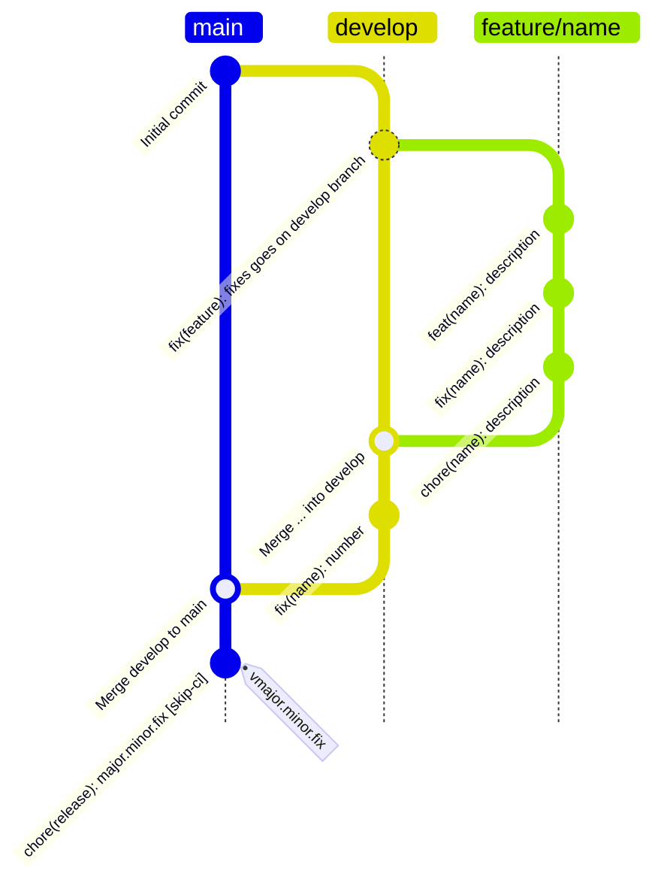

# Git Flow and semantic release convention

We follow the git flow branching model and semantic release convention. [Details
here)(https://github.com/conventional-changelog/conventional-changelog/tree/master/packages/conventional-changelog-angular).

```
<type>(<scope>): <subject>
<BLANK LINE>
<body>
<BLANK LINE>
<footer>
```

Where type can be:

| Type     | Version | Description                                                   |
|----------|---------|---------------------------------------------------------------|
| feat     | minor   | A new feature or enhancement                                  |
| fix      | patch   | A bug fix                                                     |
| docs     | patch   | Documentation change                                          |
| style    | patch   | Formatting, missing semicolons, etc                           |
| refactor | patch   | Code change that neither fixes a bug nor adds a feature       |
| perf     | patch   | Performance improvement                                       |
| test     | patch   | Adding missing tests or correcting existing tests             |
| build    | patch   | Changes that affect the build system or external dependencies |
| ci       | patch   | Changes to our CI configuration files and scripts             |
| chore    |         | Other changes that don't modify src or test files             |

- The commit message should be in the imperative mood, e.g. "fix: typo in README".
- If the commit should close an issue, add "closes #123", or "fixes #123" to the commit message, where 123 is the issue
  number.
- If the commit should be ignored by semantic-release, add "[skip-ci]" to the commit message.
- If the commit contains "BREAKING CHANGE" to the commit message, it will be considered a major release.


