# Quiz grading end-to-end

Status: proposto.

Data: 2026-08-21.

Atualizado: 2026-08-31.

## Objetivo

Este diretório é a fonte canônica do plano para fechar o fluxo de grading de
quiz, desde a autoria pelo professor até a publicação do resultado ao aluno e
sua participação no gradebook.

O documento anterior
[`quiz-assessment-end-to-end-grading-flow.md`](../quiz-assessment-end-to-end-grading-flow.md)
permanece como diagnóstico detalhado do estado encontrado. Em caso de conflito,
as decisões e a ordem de execução deste diretório prevalecem.

## Vocabulário canônico

`Review` identifica quem ou o que analisa a submissão. `Grading` é o processo
que transforma essa análise em `GradeResult`, score, feedback e resultado
oficial. Por isso, os métodos usam `Review`, enquanto contratos de resultado,
publicação e gradebook continuam usando `Grade` e `Grading`.

Modelo-alvo:

```text
None                0
PeerReview          1
AIReview            2
AutomatedReview     4
InstructorReview    8
SelfReview         16
```

Semântica:

- `PeerReview`: alunos avaliam submissões de outros alunos;
- `AIReview`: um provider de IA avalia a submissão;
- `AutomatedReview`: o servidor aplica correção determinística;
- `SelfReview`: o aluno avalia a própria submissão;
- `InstructorReview`: o instrutor avalia integralmente ou revisa por último.

O código atual ainda usa `AIGraded`, `AutoGraded` e `InstructorGraded`. Esses
nomes serão substituídos atomicamente, preservando os valores numéricos `2`,
`4` e `8`. `PeerReview = 1` já possui o nome correto. `SelfReview = 16` será
adicionado no mesmo corte de contratos. Como o produto não foi lançado, não
haverá aliases, dual-read ou compatibilidade permanente com os nomes antigos.

## Escopo de implementação

Os cinco métodos entram agora no domínio, contratos, registry, estados e UX.
Isso não significa fingir capacidades inexistentes:

- `InstructorReview` será implementado integralmente;
- `AutomatedReview` será implementado integralmente no servidor;
- `SelfReview` será implementado com contrato próprio do aluno;
- `PeerReview` aproveitará a infraestrutura existente e será conectado ao
  resultado agregado de grading;
- `AIReview` receberá interface de provider, contratos, configuração e gates,
  mas nenhuma IA concreta será incluída nesta etapa.

Sem provider registrado e compatível, `AIReview` não pode ser publicado. A
saúde transitória do provider é verificada na execução e controla espera e
retry, não a validade de uma definição já publicada. Testes podem usar provider
controlado apenas no ambiente de teste; produção nunca gera nota falsa ou
aplica fallback silencioso.

## Workflows

Somente um review primário pode ser escolhido. `InstructorReview` pode aparecer
sozinho ou como segunda e última etapa:

```text
PeerReview
AIReview
AutomatedReview
SelfReview
InstructorReview
PeerReview,InstructorReview
AIReview,InstructorReview
AutomatedReview,InstructorReview
SelfReview,InstructorReview
```

Grupo e peso não selecionam nem restringem o workflow. Eles controlam apenas a
participação do resultado final no gradebook. `GroupAssignment` também não muda
o workflow: ele define que haverá uma submission e uma avaliação compartilhadas,
com resultado projetado para os participantes depois da finalização.

## Fluxo end-to-end proposto

O diagrama abaixo representa o estado que este plano pretende alcançar. O
`Assessment Test Run` do professor e a tentativa oficial do aluno entram no
mesmo pipeline de grading, mas somente a tentativa oficial pode produzir
efeitos acadêmicos.

```mermaid
flowchart TD
    subgraph AUTHORING["Autoria pelo professor"]
        CONTENT["Criar e editar o quiz<br/>Content"]
        ASSESSMENT["Configurar o assessment<br/>grupo, peso, pontuação e disponibilidade"]
        WORKFLOW["Escolher o review primário"]
        REVIEW_CHOICE{"Exigir revisão final<br/>do instrutor?"}
        CAPABILITIES["Validar projeção segura<br/>e capabilities de AuthorTest"]
        PREPARE["Congelar revisão candidata<br/>imutável"]

        CONTENT --> ASSESSMENT --> WORKFLOW --> REVIEW_CHOICE --> CAPABILITIES --> PREPARE
    end

    subgraph PROFESSOR_TEST["Validação pelo professor"]
        TEST_RUN["Assessment Test Run<br/>modo de teste"]
        TEST_ANSWER["Professor responde<br/>em uma ou mais personas"]
        TEST_RUN --> TEST_ANSWER
    end

    subgraph PUBLICATION["Publicação da revisão"]
        PUBLISH_REQUEST["Solicitar publicação<br/>da revisão candidata"]
        HASH_MATCH{"Draft ainda corresponde<br/>à revisão candidata?"}
        PUBLISH_READY{"Capabilities de<br/>OfficialSubmission disponíveis?"}
        PUBLISH_BLOCKED["Publicação bloqueada<br/>com diagnóstico"]
        PUBLISH["Ativar a mesma revisão<br/>para uso futuro"]

        PUBLISH_REQUEST --> HASH_MATCH
        HASH_MATCH -->|"Sim"| PUBLISH_READY
        PUBLISH_READY -->|"Sim"| PUBLISH
        PUBLISH_READY -->|"Não"| PUBLISH_BLOCKED
    end

    subgraph LEARNER_RUN["Jornada acadêmica oficial"]
        LEARNER_ACCESS["Aluno acessa um assessment<br/>já publicado"]
        SUBJECT_RESOLUTION["Resolver sujeito da tentativa<br/>e congelar participantes do grupo"]
        OFFICIAL_ATTEMPT["Aluno inicia tentativa oficial<br/>com o mesmo snapshot"]
        LEARNER_ANSWER["Aluno responde e envia"]
        LEARNER_ACCESS --> SUBJECT_RESOLUTION --> OFFICIAL_ATTEMPT --> LEARNER_ANSWER
    end

    PREPARE -->|"Testar antes de disponibilizar"| TEST_RUN
    PREPARE -->|"Publicar sem test run"| PUBLISH_REQUEST
    TEST_ANSWER --> ORCHESTRATOR
    LEARNER_ANSWER --> ORCHESTRATOR

    subgraph SHARED_PIPELINE["Pipeline compartilhado no servidor"]
        ORCHESTRATOR["Orquestrador de grading<br/>workflow, rodada e contexto imutáveis"]
        PRIMARY{"Review primário"}
        PEER["PeerReview<br/>alunos revisores"]
        AI["AIReview<br/>provider configurado"]
        AUTOMATED["AutomatedReview<br/>correção determinística"]
        SELF["SelfReview<br/>autoavaliação"]
        INSTRUCTOR["InstructorReview<br/>avaliação integral"]
        PRIMARY_RESULT["GradeResult primário<br/>por item, total e evidências"]
        NEEDS_REVIEW{"Workflow inclui<br/>revisão do instrutor?"}
        RESULT_COMPLETE{"Todos os itens<br/>estão resolvidos?"}
        AWAITING_RESOLUTION["Aguardar resolução<br/>dos itens pendentes"]
        INSTRUCTOR_REVIEW["Instrutor revisa<br/>aprova ou altera"]
        FINAL_RESULT["Execução concluída<br/>com resultado estruturado"]

        ORCHESTRATOR --> PRIMARY
        PRIMARY -->|"PeerReview"| PEER
        PRIMARY -->|"AIReview"| AI
        PRIMARY -->|"AutomatedReview"| AUTOMATED
        PRIMARY -->|"SelfReview"| SELF
        PRIMARY -->|"InstructorReview"| INSTRUCTOR
        PEER --> PRIMARY_RESULT
        AI --> PRIMARY_RESULT
        AUTOMATED --> PRIMARY_RESULT
        SELF --> PRIMARY_RESULT
        INSTRUCTOR --> PRIMARY_RESULT
        PRIMARY_RESULT --> NEEDS_REVIEW
        NEEDS_REVIEW -->|"Sim"| INSTRUCTOR_REVIEW
        INSTRUCTOR_REVIEW --> FINAL_RESULT
        NEEDS_REVIEW -->|"Não"| RESULT_COMPLETE
        RESULT_COMPLETE -->|"Sim"| FINAL_RESULT
        RESULT_COMPLETE -->|"Não"| AWAITING_RESOLUTION
    end

    FINAL_RESULT --> CONTEXT{"Contexto da execução"}

    subgraph TEST_OUTCOME["Saída do test run"]
        TEST_RESULT["Professor inspeciona<br/>resultado, etapas e diagnósticos"]
        NO_EFFECTS["Sem enrollment, progresso,<br/>gradebook ou notificação acadêmica"]
        TEST_COMPLETE["Test run concluído"]
        TEST_RESULT --> NO_EFFECTS --> TEST_COMPLETE
    end

    subgraph OFFICIAL_OUTCOME["Saída acadêmica oficial"]
        ACADEMIC_FINALIZED["Persistir rodada oficial<br/>e GradeResultFinalized"]
        SUBJECT_PROJECTION["Projetar resultado para o sujeito<br/>individual ou participantes do grupo"]
        RELEASE_POLICY{"Política permite liberar<br/>o resultado agora?"}
        WITHHELD["Resultado retido ou agendado"]
        RELEASE_COMMAND["ReleaseGradeResult<br/>autorizado e idempotente"]
        RELEASED["Resultado liberado"]
        LEARNER_RESULT["Aluno vê nota e feedback permitidos"]
        LEARNER_GRADEBOOK["Projetar gradebook learner<br/>sem contribuições retidas"]
        ATTEMPT_POLICY["Determinar contribuição<br/>efetiva das tentativas"]
        GRADEBOOK{"Peso do grupo<br/>é maior que zero?"}
        APPLY_GRADE["Consolidar no gradebook"]
        PRACTICE["Manter como atividade prática<br/>sem contribuição na nota final"]

        ACADEMIC_FINALIZED --> SUBJECT_PROJECTION
        SUBJECT_PROJECTION --> RELEASE_POLICY
        SUBJECT_PROJECTION --> ATTEMPT_POLICY --> GRADEBOOK
        RELEASE_POLICY -->|"Não"| WITHHELD
        WITHHELD -->|"Liberação manual"| RELEASE_COMMAND --> RELEASED
        RELEASE_POLICY -->|"Sim"| RELEASED
        RELEASED --> LEARNER_RESULT
        RELEASED --> LEARNER_GRADEBOOK
        GRADEBOOK -->|"Sim"| APPLY_GRADE
        GRADEBOOK -->|"Não"| PRACTICE
    end

    CONTEXT -->|"AuthorTest"| TEST_RESULT
    CONTEXT -->|"OfficialSubmission"| ACADEMIC_FINALIZED
    TEST_COMPLETE -.->|"Ação posterior e opcional do professor"| PUBLISH_REQUEST
    HASH_MATCH -->|"Não, editar e preparar novamente"| CONTENT
    PUBLISH -.->|"Acesso posterior e independente"| LEARNER_ACCESS
```



Leitura central do fluxo:

- content define o que será respondido;
- assessment define como, quando e por quem o conteúdo será avaliado;
- review identifica a origem da avaliação e grading produz o resultado;
- test run usa uma revisão candidata imutável e termina integralmente no
  contexto do instrutor; em um comando posterior e opcional, o publish ativa
  essa mesma revisão se o draft ainda possuir o mesmo hash e capabilities
  oficiais, sem criar tentativa, enrollment ou ação para aluno;
- toda execução do test run é manipulada pelo instrutor em contexto
  `AuthorTest` e termina no próprio fluxo de autoria;
- a jornada acadêmica começa separadamente quando um aluno acessa um assessment
  já publicado; somente então a tentativa oficial referencia a revisão ativa;
- `InstructorReview` é review primário quando usado sozinho e review final
  quando combinado com outro método;
- `AIReview` somente publica quando um provider compatível está registrado;
- indisponibilidade transitória de provider retém o estágio para retry e nunca
  invalida a revisão publicada nem produz score zero;
- `AutomatedReview` avalia os itens determinísticos e preserva os demais como
  pendentes; com instrutor, ele completa e revisa esse resultado;
- grupo e peso são aplicados somente depois que o pipeline produz um resultado
  final;
- em tentativa coletiva, o grupo é resolvido antes do grading e o resultado
  único é projetado para os participantes depois da finalização;
- cada mutação aceita do draft coletivo produz auditoria append-only com ator,
  versão e request hash; replay idêntico não duplica o registro;
- finalização alimenta gradebook e auditoria; liberação separada controla o que
  o aluno pode ver e quando ele é notificado;
- gradebook interno pode usar resultado finalizado, enquanto dashboard,
  workspace e gradebook learner usam somente rodadas liberadas e não expõem
  agregados que permitam inferir contribuição retida;
- somente a contribuição efetiva produzida pela policy canônica entra no
  gradebook;
- liberação manual passa por comando autorizado, concorrente e idempotente;
- o contexto de execução determina se o resultado é apenas diagnóstico ou se
  pode gerar efeitos acadêmicos.

## Documentos

| Documento | Área | Resultado esperado |
| --- | --- | --- |
| [00-domain-and-workflows.md](./00-domain-and-workflows.md) | domínio e UX | vocabulário, combinações, precedência e estados fechados |
| [01-contracts-and-persistence.md](./01-contracts-and-persistence.md) | contratos e dados | schemas versionados, baseline limpo e auditoria coerente |
| [02-authoring-and-publication.md](./02-authoring-and-publication.md) | professor | quiz, grading e assessment salvos atomicamente |
| [03-author-assessment-test-runs.md](./03-author-assessment-test-runs.md) | professor | execução completa do assessment sem efeitos acadêmicos |
| [04-graders-and-instructor-review.md](./04-graders-and-instructor-review.md) | handlers | cinco reviews, providers e revisão docente final |
| [05-learner-attempts-and-results.md](./05-learner-attempts-and-results.md) | aluno | tentativa oficial, payload seguro e resultado completo |
| [06-gradebook-audit-and-operations.md](./06-gradebook-audit-and-operations.md) | consolidação | nota final, pesos, auditoria, filas e notificações |
| [07-delivery-roadmap-and-tests.md](./07-delivery-roadmap-and-tests.md) | qualidade | estratégia de PRs, gates e matriz E2E |
| [08-implementation-sequence.md](./08-implementation-sequence.md) | execução | índice, regras globais e passagem entre as três partes |
| [Parte 1](./implementation-sequence/01-foundation-and-authoring.md) | execução | fundação, autoria, segurança e publicação fail-closed |
| [Parte 2](./implementation-sequence/02-core-grading-e2e.md) | execução | test run e E2E oficial individual e coletivo |
| [Parte 3](./implementation-sequence/03-review-expansion-and-operations.md) | execução | reviews adicionais, operação e auditoria final |

Os documentos `00` a `06` são especificações temáticas e sua numeração não é
uma sequência de codificação. A ordem obrigatória de implementação está no
índice [`08-implementation-sequence.md`](./08-implementation-sequence.md), que
encadeia três partes executadas e aprovadas separadamente. O documento `07`
detalha os testes e critérios transversais consumidos por essa sequência.

## Decisões estruturais obrigatórias

As seguintes decisões fazem parte do plano e devem ser fechadas antes de alterar
o baseline de schema do fluxo:

1. `Assessment` mantém a definição autoral mutável. O test run usa uma
   `AssessmentDefinitionRevision` candidata e imutável; o publish ativa a mesma
   revisão, e execuções oficiais só usam a revisão ativa. O
   `Assessment.DefinitionPayload` genérico e seu setter são removidos; fonte
   mutável complexa só existe como contrato tipado e com ownership próprio.
2. A publicação é explícita: um ponteiro de revisão ativa diferencia draft,
   alterações pendentes e definição executável. `ProgramContent.Visibility`
   não substitui esse lifecycle.
3. Scores, pesos e percentuais acadêmicos são inteiros de escala `100`,
   inclusive no banco e no JSON. `Assessment.PassingScore` é o
   limiar absoluto da submissão; `Program.PassingScore` continua sendo o
   percentual global do curso e só é aplicado na consolidação global. Todos os
   campos acadêmicos já existentes são convertidos no baseline da fundação,
   antes do primeiro test run.
4. Review é um estágio de lifecycle. Métodos interativos aguardam evidências;
   somente avaliadores determinísticos ou externos podem concluir no start.
5. `GradingExecution` é a raiz compartilhada de stages, rodadas, evidências e
   resultados. Ela possui exatamente um owner relacional:
   `AssessmentTestRunSubject` ou `AssessmentSubmission`. Um test run possui um
   ou mais sujeitos sintéticos, permitindo testar peer review sem misturar
   múltiplos resultados na mesma execução. `AuditLogs` é projeção de compliance,
   e efeitos externos saem por outbox transacional.
6. Testes de `PeerReview` modelam vários participantes e respostas sintéticas
   no agregado isolado de test run.
7. Claims de pares têm lease, expiração e reatribuição. Evidência insuficiente
   após o prazo entra em `AwaitingInstructorResolution`; comandos docentes
   idempotentes podem estender, reatribuir ou finalizar por resolução explícita,
   sem fabricar conclusão peer.
8. `ContentGradingDefinitionV2` possui somente configuração autoral adicional
   por ID de item; não copia ID, pontos, tipo ou capability. Em quiz,
   `QuizEntry.points` textual canônico é a fonte única, e políticas de execução
   pertencem ao Assessment.
9. `AuthoringSourceHash` usa `AssessmentAuthoringSourceV1`, JCS e SHA-256 e é
   a única identidade de `Published`/`ChangesPending`.
10. Resultado finalizado e resultado liberado são estados independentes.
    Somente submission oficial possui estado de release; test run termina em
    resultado diagnóstico.
11. `AIReview` sai por outbox e retorna por inbox idempotente; nenhuma chamada
    externa ocorre dentro da transação de submit.
12. Quiz atribuído a grupo possui uma única submission, rodada e avaliação. Um
    snapshot de participantes é criado no start, e o resultado único gera
    projeções individuais idempotentes depois da finalização.
13. Eventos acadêmicos duráveis são gravados em outbox na mesma transação. Eles
    não usam simultaneamente a publicação em processo executada pelo
    `ApplicationDbContext.SaveChangesAsync`. Cada consumer obrigatório confirma
    sua própria entrega por `(EventId, ConsumerKey)`; a mensagem termina somente
    quando todos confirmarem.
14. Capabilities são declaradas por contexto. `AuthorTest` permite executar a
    candidata no test run; somente `OfficialSubmission` permite publish e
    execução acadêmica.
15. Rotas learner/public nunca retornam o DTO autoral de um quiz avaliável. A
    fronteira é fechada antes do primeiro test run e permanece fail-closed até
    o bundle oficial existir.
16. A conclusão comum do orquestrador é neutra. Somente uma submission oficial
    produz `GradeResultFinalized`; test run persiste resultado diagnóstico.
17. Uma policy canônica seleciona a contribuição efetiva usada pelo gradebook e
    pelas integrações de score. O primeiro modo seleciona uma tentativa; uma
    eventual média é agregação explícita. Uma policy separada define em qual
    transição o content avaliado progride e sua semântica diante de múltiplas
    tentativas. Múltiplas tentativas ficam bloqueadas até a contribuição
    canônica existir.
18. Liberação manual usa `ReleaseGradeResult`, com autorização, rodada esperada,
    concorrência, idempotência e auditoria.
19. Cada revisão fixa um `AssessmentExecutionManifestV1` coberto, junto da
    fonte autoral, por `ExecutionSnapshotHash`. Publish, test run, tentativa
    oficial e regrade resolvem as versões exatas do adapter agregado por tipo
    de assessment, handler, policy e provider, sem fallback implícito após
    deploy. O manifest não altera o estado autoral do assessment.
    O publish somente revalida o manifest fixado: `revisionId`, bytes canônicos
    e hash permanecem idênticos entre prepare, teste, publish e start oficial.
    Cada `GradingExecution` materializa separadamente uma
    `AssessmentExecutionDeliveryV1`, com `itemOrder` explícito e JSON canônico
    textual; resume e retry preservam seus bytes e `DeliveryHash`. Todo dado
    privado necessário à correção é derivável da revisão mais essa entrega.
20. Start, saves de draft de tentativa ou evidência, submit, finalização de
    evidência e release compartilham o contrato idempotente: mesmo escopo,
    chave e request hash retornam o outcome persistido; payload divergente gera
    conflito depois da autorização e replay não duplica auditoria.
21. Cada artefato anuncia as versões executáveis suportadas. Um preflight
    consulta revisões ativas, revisões retidas elegíveis a regrade e execuções
    não terminais e bloqueia o deploy antes do tráfego quando alguma versão não
    puder ser resolvida; retenção de artefatos preserva rollback e regrade.
22. A infraestrutura existente de peer pode fornecer claims, anonimato e
    workspace, mas submit, agregação, score e notificações passam pela
    `GradingExecution`; o caminho anterior perde autoridade no mesmo corte E2E.
23. Quiz avaliado é submetido somente por `AssessmentSubmission`. As rotas
    genéricas de `ProgramContent`/`ContentInteraction`, complete/update progress
    e escritas de `ActivityGrade` rejeitam esse quiz. Somente a projeção
    canônica pode atualizar o read model de progresso conforme a policy de
    conclusão congelada na revisão.
24. Regrade reutiliza revisão, manifest, entrega e respostas da execução.
    Avaliar outra definição cria nova submission e nova execução. Release é
    versionado por rodada; a última rodada liberada continua learner-visible até
    o release da substituta.
25. Projeções learner de submission, dashboard, workspace, gradebook e nota
    global consomem somente rodadas liberadas e não expõem valores agregados que
    permitam inferir um resultado retido.
26. Conclusão dependente de aprovação usa `on-release-and-pass`; progresso,
    pré-requisito ou certificado não pode revelar `Passed` antes do release.
27. Release referencia somente `GradeRoundId`. A submission é derivada pelo
    owner da `GradingExecution` e validada pelo comando.
28. Unpublish remove somente o ponteiro ativo, bloqueia novos starts e preserva
    revisões e submissions já iniciadas.
29. Assessment sem grupo conserva resultado sem colocação. Alterar grupo ou peso
    reprojeta o gradebook de forma auditada e não cria nova avaliação.
30. Release agendado usa schedule/cancel/reagendamento idempotentes e o worker
    chama `ReleaseGradeResult` em vez de editar estado diretamente.
31. O baseline limpo reinstala todo artefato SQL ativo aprovado fora do `IModel`,
    com inventário, ordem de dependências e teste funcional.
32. Rounds, stages e handlers usam `GradeResultV1` e `GradeItemResultV1`
    genéricos. Payloads e evidências específicos de quiz pertencem ao adapter e
    nunca aparecem como tipo obrigatório no core de grading.
33. Respostas usam `AssessmentResponseEnvelopeV1`; quiz fornece o payload
    discriminado `QuizAnswerEnvelopeV1` para seus 14 tipos, sem JSON embutido
    em string ou representações delimitadas.
34. Matching e Ordering implementam crédito parcial versionado por proporção de
    pares corretos e posições absolutas corretas, respectivamente, com
    aritmética exata e quantização única de `ScoreValue`.

Essas decisões podem justificar colunas e entidades novas. Cada fatia com
impacto relacional exige o `SCHEMA-GATE` descrito na sequência canônica, com
ownership, consultas, retenção e estratégia de concorrência aprovados. A
alteração é feita diretamente no mesmo baseline global inicial pré-lançamento, seguida
da recriação dos bancos descartáveis, sem migration incremental ou migração de
dados. O gate compara tanto o modelo EF quanto os catálogos PostgreSQL de
funções, procedures, triggers, policies, grants, views, extensões e índices
especiais; preservar esses artefatos atuais não significa manter legado.

## Dependências

Esta visão apresenta dependências conceituais, não substitui as três partes da
fila executável indexada por
[`08-implementation-sequence.md`](./08-implementation-sequence.md).

```text
domínio e workflows
  -> ADRs de publicação, precisão e histórico
     -> contratos e matriz de autorização
        -> schema do núcleo e reset global do baseline
           -> autoria atômica
              -> projeção learner-safe, corte de rotas e capabilities
                 -> revisão imutável e publish/unpublish preparados
                    -> test run do professor
                       -> InstructorReview
                          -> AutomatedReview
                             -> primeiro E2E acadêmico individual
                                -> tentativa coletiva
                                   -> SelfReview oficial
                                      -> PeerReview oficial
                                         -> porta de AIReview
                                            -> operação avançada
```

`InstructorReview` fecha primeiro o caminho no test run porque a API já possui
a infraestrutura genérica mais próxima desse fluxo. `AutomatedReview` comprova
em seguida o primeiro avaliador do servidor. Nesses dois marcos, ambos declaram
somente capability `AuthorTest`; `OfficialSubmission` e o publish de produção
são liberados quando entram no primeiro E2E acadêmico, incluindo release e
gradebook mínimos. A tentativa
coletiva substitui imediatamente o fan-out atual; `SelfReview` e `PeerReview`
são implementados depois, já sobre sujeitos individuais e coletivos.
`AIReview` encerra sua etapa quando a porta está pronta e um provider de teste
comprova o contrato; a integração concreta permanece substituível.

## Fronteiras de ownership

- `@game-guild/quiz`: questões e respostas de quiz;
- `@game-guild/quiz-content`: documento autoral persistido;
- `@game-guild/quiz-surface`: autoria, execução e visualização;
- `@game-guild/grading`: contratos e algoritmos puros de grading;
- `@game-guild/grading-adapter-quiz`: integração entre quiz e grading,
  incluindo projeção dos itens, answer key, redaction, normalização de respostas,
  capacidades determinísticas e fixtures de conformidade específicas de quiz;
- módulo API `Learning.Assessments`: workflow confiável, autorização,
  persistência e nota oficial;
- web Learning: composição das superfícies e chamadas da API;
- gradebook: consumo de resultados finalizados, sem executar reviews.

O JSON autoral não deve carregar estado operacional de tentativa. O package de
grading não deve decidir grupo, peso, autorização, fila ou publicação.
`ContentGradingDefinitionV2` contém os itens avaliáveis; tentativas, tempo,
disponibilidade, apresentação operacional, passing score e liberação pertencem
ao assessment.

Resultados do core são `GradeResultV1`/`GradeItemResultV1`, e respostas entram
por `AssessmentResponseEnvelopeV1`. Contratos `Quiz*` ficam no domínio, adapter
e superfícies específicas do quiz, nunca no core de grading.

`@game-guild/grading` não depende de `@game-guild/quiz`, `@game-guild/quiz-content`
ou `@game-guild/quiz-surface`. O adapter depende somente das APIs públicas de
`@game-guild/grading` e `@game-guild/quiz`; nenhuma dependência reversa é
permitida. Novos tipos de assessment recebem adapters irmãos, sem ampliar o
conhecimento do core de grading sobre domínios de conteúdo.

`@game-guild/quiz-content` pode consumir contratos genéricos de grading e o
adapter para montar seu documento autoral, mas não implementa novamente
redaction, answer key, normalização ou correção. `@game-guild/quiz` e
`@game-guild/quiz-surface` permanecem independentes do adapter.

## Regras de execução do plano

- não criar nem executar migration incremental para transformar bancos atuais;
- não criar migration de dados, backfill, aliases, dual-read ou dual-write;
- tratar a substituição da cadeia histórica como operação global, pois o único
  `ApplicationDbContext` e seu startup com `MigrateAsync` abrangem todos os
  módulos; alternativamente, trocar primeiro o mecanismo de criação de banco;
- editar diretamente esse mesmo baseline após cada `SCHEMA-GATE` aprovado; ao
  final existe somente o baseline que cria o schema final;
- inventariar e reinstalar no baseline todo SQL ativo fora do `IModel`; diff do
  snapshot EF sozinho não autoriza remover função, trigger, policy, grant, view,
  extensão ou índice especial de outro módulo;
- recriar bancos locais, de desenvolvimento e de teste afetados, sem preservar
  os dados atuais;
- publicação, precisão de score e histórico acadêmico devem estar fechados em
  ADRs antes de alterar entidades EF;
- não haverá compatibilidade legacy ou migração de documentos, pois o produto
  não foi lançado;
- os bits `1`, `2`, `4` e `8` permanecem por serem o contrato canônico final,
  não para preservar registros existentes;
- cada marco deve entregar uma fatia vertical testável;
- autoria atômica e projeção learner-safe precedem prepare e publish;
- o corte das rotas learner/public que expõem DTO autoral ocorre junto da
  projeção segura, não no primeiro E2E oficial;
- o primeiro E2E oficial usa `InstructorReview` e `AutomatedReview` antes dos
  reviews de menor prioridade arquitetural;
- a UI nunca será a única responsável por validar combinação, precedência ou
  autorização;
- ator autenticado e sujeito representado são identidades distintas e seguem
  a matriz de autorização;
- o browser nunca produz resultado oficial de `AutomatedReview` ou `AIReview`;
- a API valida combinações, atores, capabilities e registro do provider;
- capability `AuthorTest` nunca é promovida implicitamente para
  `OfficialSubmission`;
- a saúde do provider é requisito de execução e retry, não de publicação;
- ausência de provider nunca é convertida em score;
- cada review produz o mesmo contrato versionado de `GradeResult`;
- grading não executa por integrante: tentativas coletivas produzem um único
  resultado e o subsistema de grupos faz as projeções posteriores;
- self review coletivo produz uma evidência compartilhada, e peer review de
  grupo mantém revisores individuais que não podem pertencer ao grupo-alvo;
- coverage parcial de `AutomatedReview` não é falha técnica;
- enquanto não houver outra decisão de produto, `AutomatedReview` direto com
  coverage parcial não possui readiness para publish oficial; combinado com
  `InstructorReview`, os itens pendentes seguem para o instrutor;
- finalização e liberação de resultado nunca compartilham o mesmo evento;
- regrade nunca troca revisão, manifest, entrega ou respostas da execução e não
  oculta implicitamente a última rodada liberada;
- test run não emite `GradeResultFinalized` ou `GradeResultReleased`;
- gradebook e integrações de score usam a mesma contribuição efetiva; a policy
  de conclusão governa progresso separadamente. Sem contribuição canônica,
  `maxAttempts > 1` permanece bloqueado;
- liberação manual passa por `ReleaseGradeResult`, nunca por atualização direta
  de estado;
- release persiste somente o `GradeRoundId` e deriva sua submission pela
  execução; não existe ID redundante que possa divergir;
- `on-release-and-pass` não projeta conclusão ou outro sinal learner-visible
  enquanto a rodada estiver retida;
- unpublish bloqueia novos starts e preserva execuções existentes;
- assessment sem grupo não entra no gradebook; mudança de grupo/peso reprojeta
  sem reabrir grading;
- scheduler usa comandos idempotentes e nunca grava `Released` diretamente;
- eventos acadêmicos duráveis entram na outbox antes do commit e não são
  publicados também pelo dispatcher em processo;
- cada consumer confirma sua entrega durável de forma independente e replay não
  duplica efeitos já confirmados;
- cada caminho anterior é removido no mesmo corte em que seu substituto passa
  no E2E; o último marco apenas audita resíduos.

## Definição global de pronto

O sistema somente estará completo quando:

- professor cria e publica um quiz avaliável sem divergência entre content e
  assessment;
- professor exercita os workflows compatíveis com o test run sem efeitos
  acadêmicos;
- test run conclui sem emitir eventos consumidos pela jornada acadêmica;
- aluno recebe uma definição sem answer key e envia respostas estruturadas;
- quiz avaliado usa somente `AssessmentSubmission`; `submitActivity` e os
  endpoints genéricos de content não aceitam sua resposta;
- nenhuma rota learner/public expõe DTO autoral, inclusive por endpoint
  genérico;
- os cinco reviews são reconhecidos pelo domínio e pelo orquestrador;
- `InstructorReview`, `AutomatedReview`, `SelfReview` e `PeerReview` chegam a
  resultado completo;
- `AIReview` possui porta pronta e execução bloqueada sem provider;
- os quatro reviews não docentes podem ser seguidos de `InstructorReview`;
- `InstructorReview` combinado sempre executa por último;
- cada tentativa referencia um snapshot imutável da definição;
- cada execução referencia uma entrega concreta imutável, gerada no servidor;
- a entrega possui ordem de itens explícita, JSON canônico textual e não depende
  de estado privado aleatório não persistido;
- lifecycle autoral compara somente `AuthoringSourceHash`, sem falso
  `ChangesPending` causado por deploy ou manifest;
- cada execução resolve exatamente o manifest da revisão mesmo após deploy;
- prepare, test run, publish e start oficial preservam `revisionId`, bytes do
  manifest e `ExecutionSnapshotHash`;
- preflight de deploy comprova a resolução antes do tráfego e mantém artefato
  compatível para rollback;
- publish exige capability `OfficialSubmission`, independentemente da
  capability de test run;
- resultados por item, atores, versões, overrides e regrades são auditáveis;
- aluno vê estado, nota e feedback somente após liberação conforme a política;
- conclusão dependente de aprovação também aguarda release e não revela
  `Passed` por progresso, pré-requisito ou certificado;
- dashboard, workspace, gradebook learner e nota global não expõem nem permitem
  inferir contribuição retida;
- regrade preserva a última rodada liberada até o release da nova e permanece na
  revisão, manifest, entrega e respostas originais;
- liberação manual usa comando autorizado, concorrente e idempotente;
- release agendado, cancelamento, reagendamento e worker usam o mesmo contrato
  idempotente e produzem um único evento por rodada;
- gradebook considera somente pipelines finalizados e aplica o peso do grupo;
- assessment sem grupo permanece sem colocação, e troca de grupo/peso reprojeta
  sem alterar workflow ou histórico;
- content avaliado recebe uma única projeção de progresso por enrollment a
  partir da transição canônica definida na policy, sem rota genérica concorrente;
- `Assessment.PassingScore` decide a aprovação da submission, enquanto
  `Program.PassingScore` participa somente da consolidação global do curso;
- múltiplas tentativas produzem uma única contribuição efetiva conforme a
  policy canônica;
- tentativa coletiva gera exatamente uma rodada, auditoria e regrade;
- tentativa coletiva possui draft versionado e um único submit final atômico;
- cada alteração aceita do draft coletivo possui auditoria append-only sem
  duplicação em replay;
- o draft coletivo de `SelfReview` possui a mesma idempotência e auditoria por
  mutação;
- `PeerReview` não mantém controller, service ou action paralelos capazes de
  atribuir score agregado ou emitir notificação acadêmica;
- `PeerReview` insuficiente entra em `AwaitingInstructorResolution` e possui
  comandos auditáveis de extensão, reatribuição e resolução docente;
- SpeedGrader não usa rota ou service paralelo que atribua score diretamente;
- filas, tarefas e SpeedGrader não usam `CanonicalRow` ou submissions irmãs
  para representar tentativa coletiva;
- nenhuma coluna acadêmica decimal do escopo permanece como `decimal` ou
  ponto flutuante;
- banco vazio preserva todos os artefatos SQL ativos aprovados fora do `IModel`
  e seus testes funcionais;
- os nove workflows possuem testes de domínio e autorização;
- workflows executáveis possuem E2E; `AIReview` sem provider possui teste de
  bloqueio e contrato de integração.
