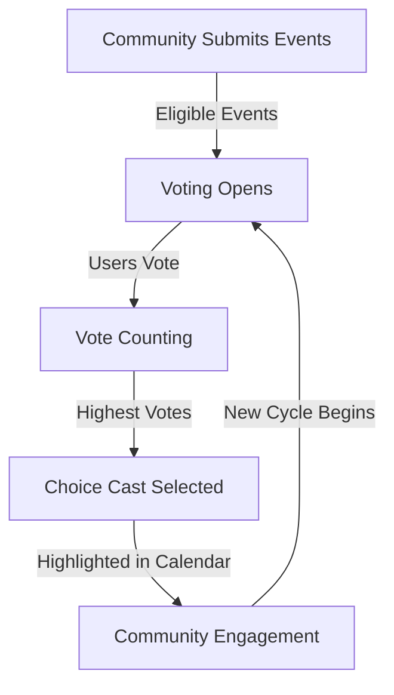

# Choice Cast - Functional Requirements

## Overview
The **Choice Cast** is a special community-driven event that receives additional visibility and rewards. Community members vote for an event to be highlighted in the calendar. Its recurrence depends on community interest based on how many participants had in the last meeting.

## Features

!!! info "Key Features"
    - Community votes for one event to become the **Choice Cast** of the week.
    - The event is chosen based on **platform votes** in the current possible events.
    - The event can be **repeated based on demand** from previous attendees.

## Workflow

## Functional Requirements

### 1. Voting System

!!! note "Voting Mechanics"
    - Users vote for their preferred **Choice Cast**.
    - Each user gets **one vote per cycle**.
    - Votes are stored and updated in real-time.
    - Votes close in the end of the current cycle at leat 2 hours before the meeting.

#### Functions

- **`voteForChoiceCast(eventId: string, userId: string): Promise<void>`**
    - Registers a vote for an event.
    - Ensures the user hasn't already voted.
    - Updates vote count for the event.

- **`getChoiceCastCandidates(): Promise<Event[]>`**
    - Returns a list of events eligible for voting.

- **`getVotesForChoiceCast(eventId: string): Promise<number>`**
    - Retrieves the vote count for a specific event.

---

### 2. Selection of Choice Cast

!!! warning "Selection Rules"
    - The event with the **most votes** is chosen.
    - If there is a tie, **admin intervention** may be required.
    - **Choice Casts** will reset at the beggining of the next cycle.

#### Functions

- **`selectChoiceCast(): Promise<Event>`**
    - Determines the event with the highest votes.
    - Updates the event’s status as the **Choice Cast**.
    - Notifies the community.

---

### 3. Highlighting and Rewards

!!! tip "Boosting Visibility"
    - Choice Cast events are **pinned in the calendar**.
    - Organizers and attendees receive **exclusive rewards**.

#### Functions
- **`highlightChoiceCast(eventId: string): Promise<void>`**
    - Marks the event as a featured event.

- **`rewardChoiceCastParticipants(eventId: string): Promise<void>`**
    - Distributes rewards to attendees and event organizers.

---

## Conclusion

The **Choice Cast** system enables community-driven decision-making, promotes engagement, and ensures valuable events receive proper recognition. This document outlines the required functionalities and interactions for effective implementation.
