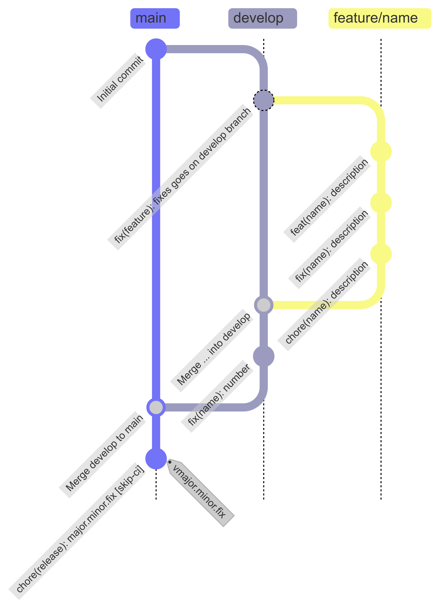
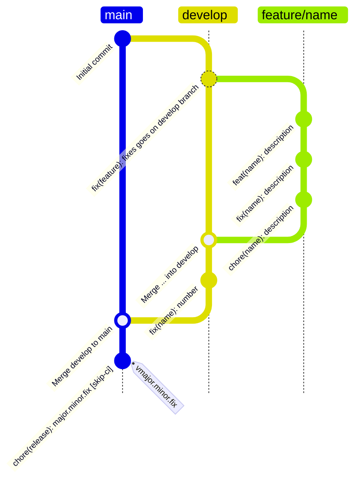

```mermaid
gitGraph TB:
   %% Main branch initial commit
   commit id:"Initial commit" 

   %% Create develop branch from main
   branch develop
   checkout develop
   commit id:"fix(feature): fixes goes on develop branch"   %% Direct fix commit on develop

   %% Create a feature branch off develop
   branch feature/name
   checkout feature/name
   commit id:"feat(name): description"
   commit id:"fix(name): description"
   commit id:"chore(name): description"
   
   %% Merge the feature branch back into develop
   checkout develop
   merge feature/name id:"Merge ... into develop"
   
   %% Additional fix commit directly on develop (as per process)
   commit id:"fix(name): number"

   %% Release process: admin merges develop into main
   checkout main
   merge develop id:"Merge develop to main"
   
   %% Automatic release commit by semantic-release-bot
   commit id:"chore(release): major.minor.fix [skip-ci]" tag:"vmajor.minor.fix"
```