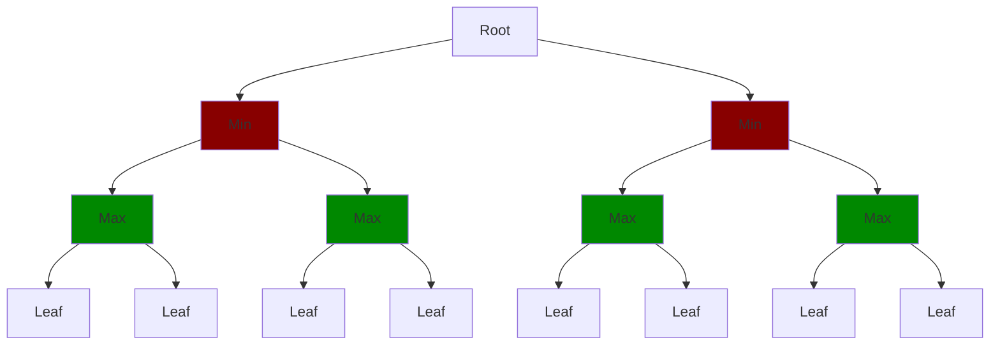
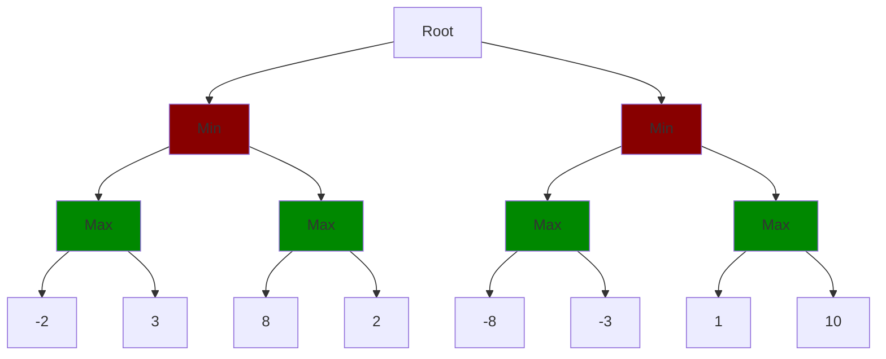
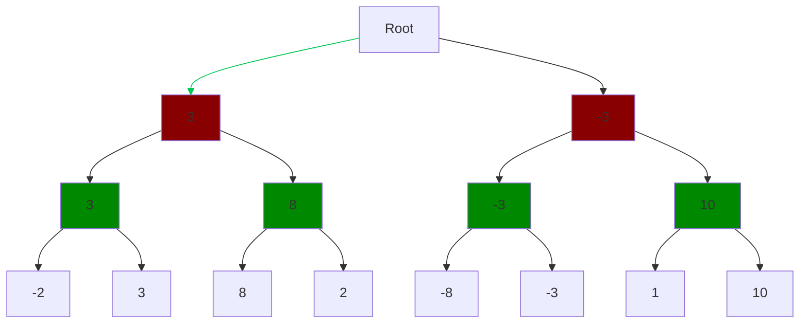

# Min Max Search

<details>
<summary>Lecture Notes</summary>

- Heuristics
- Min Max Search
- Alpha Beta Pruning

</details>

Video explanation: [Min Max Search](https://www.youtube.com/watch?v=l-hh51ncgDI) and this [other one](https://www.youtube.com/watch?v=trKjYdBASyQ)

Min Max Search is a search algorithm used in two-player turn based adversarial games to find the optimal move for the player. It works by exploring all possible moves and their outcomes, and selecting the move that maximizes the player's chances of winning while minimizing the opponent's chances. The algorithm assumes that both players play optimally.

[meme](https://media.makeameme.org/created/thats-my-secret-dece4a572a.jpg)

## Heuristics

Heuristics are rules of thumb or strategies that help us make decisions or solve problems more efficiently. Heuristics are functions which will feed on the state and generate a score.

In the context of Min Max Search, heuristics are used to evaluate the desirability of a game state. They provide a way to estimate the value of a position without having to search all possible moves.

In chess, heuristics can be:

- **Material balance**: The difference in value between the pieces on the board. For example, Queen is worth 9 points, Rook: 5, Bishop and Knight: 3 points, and Pawn: 1 point. And king can worth 100 points for our algorithmic purposes.
- **Pawn Structure**: The arrangement of pawns on the board. Isolated, passed, chained, backward, doubled, tripled, quadrupled. Open files, closed files, half open files.
- **King Safety**: The safety of the king. Is it exposed to attacks? Is it well protected?
- **Space**: The amount of space controlled by the pieces. More space means more mobility and more options.
- **Weak/Strong Squares**: The squares that are weak or strong for each player. Strong squares are squares that can be occupied by pieces and weak squares are squares that can be attacked.
- **Development**: The number of pieces that are developed and active. More developed pieces mean more options and more control over the board.
- **Control of the center**: The control of the center squares. Controlling the center means more mobility and more options.
- **Initiative**: The player who has the initiative is the one who is forcing the opponent to react. The player with the initiative has more options and more control over the game.

We need to evaluate the board in order to generate a score, so we can look ahead and search for the best move.

## Min Max Search

The Min Max Search algorithm works by recursively exploring all possible moves and by evaluating the heuristics, their probable outcomes. 

In a min max search tree, the root node represents the current state of the game. The child nodes represent all possible moves that can be made from that state, and so on.

The naive implementation of Min Max Search is to clamp the maximum depth of the search tree. This means that we will only search a certain number of moves ahead. The deeper we go, the more accurate the evaluation will be, but the more time it will take to compute.

--- 
::: note "Work in Progress"

The code above here is WiP. It is taking so much time for me to write it. Sorry. Use the links to continue reading and watch the videos.

- [Min Max Search](https://www.youtube.com/watch?v=l-hh51ncgDI)
- [other one](https://www.youtube.com/watch?v=trKjYdBASyQ)

:::

## Simple Min-Max

``` c++ 
// Minimax function
int minimax(const State& state, int depth, bool isMaximizingPlayer) {
    using namespace numeric_limits;
    // Base cases: terminal state or maximum depth reached
    // evaluate the board only if depth is 0 or state is terminal
    if (depth == 0 || state.isTerminal()) return state.evaluate();
    
    // Get all possible moves from current state
    vector<Move> moves = state.getPossibleMoves();
    
    // Initialize bestValue based on player, use <limits>
    int bestValue = isMaximizingPlayer ? numeric_limits<int>::min() : numeric_limits<int>::max();
    
    // Traverse all children
    for (const Move& move : moves) {
        // Create a new state by applying the move
        State nextState = state.applyMove(move);
        
        // Recursively call minimax for the new state
        int value = minimax(nextState, depth - 1, !isMaximizingPlayer);
        
        // Update bestValue based on player
        if (isMaximizingPlayer) {
            bestValue = max(bestValue, value);
        } else {
            bestValue = min(bestValue, value);
        }
    }
    
    return bestValue;
}

// Function to find the best move using minimax
Move findBestMove(const State& state, int depth) {
    vector<Move> moves = state.getPossibleMoves();
    int bestValue = numeric_limits<int>::min();
    Move bestMove;
    
    // Iterate through all possible moves
    for (const Move& move : moves) {
        State nextState = state.applyMove(move);
        int moveValue = minimax(nextState, depth - 1, false);
        // update bestValue and bestMove 
        if (moveValue > bestValue) {
            bestValue = moveValue;
            bestMove = move;
        }
    }
    
    return bestMove;
}
```

## Alpha Beta Pruning

``` c++ 
// Minimax function with alpha-beta pruning
int minimax(const State& state, int depth, int alpha, int beta, bool isMaximizingPlayer) {
    // Base cases: terminal state or maximum depth reached
    // evaluate the board only if depth is 0 or state is terminal
    if (depth == 0 || state.isTerminal()) return state.evaluate();
    
    // Get all possible moves from current state
    vector<Move> moves = state.getPossibleMoves();
    
    // Initialize best value based on player
    int bestValue = isMaximizingPlayer ? numeric_limits<int>::min() : numeric_limits<int>::max();
    
    // Traverse all children
    for (const Move& move : moves) {
        // Create a new state by applying the move
        State nextState = state.applyMove(move);
        
        // Recursively call minimax for the new state with alpha-beta pruning
        int value = minimax(nextState, depth - 1, alpha, beta, !isMaximizingPlayer);
        
        // Update bestValue based on player
        if (isMaximizingPlayer) {
            bestValue = max(bestValue, value);
            alpha = max(alpha, bestValue);
        } else {
            bestValue = min(bestValue, value);
            beta = min(beta, bestValue);
        }
        
        // Alpha-beta pruning
        if (beta <= alpha)
            break; // Pruning
    }
    
    return bestValue;
}

// Function to find the best move using minimax with alpha-beta pruning
Move findBestMove(const State& state, int depth) {
    vector<Move> moves = state.getPossibleMoves();
    int bestValue = numeric_limits<int>::min();
    int alpha = numeric_limits<int>::min();
    int beta = numeric_limits<int>::max();
    Move bestMove;
    
    for (const Move& move : moves) {
        State nextState = state.applyMove(move);
        int moveValue = minimax(nextState, depth - 1, alpha, beta, false);
        
        if (moveValue > bestValue) {
            bestValue = moveValue;
            bestMove = move;
        }
        
        alpha = max(alpha, bestValue);
    }
    
    return bestMove;
}
```

---

Let's assume a depth of 3 and all possible moves which can be achievable up to 3 moves ahead. The tree will look like this:



The task is to evaluate the board on the leaf nodes and propagate the values up to the root node. The Min Max Search algorithm will select the maximum value for the player and the minimum value for the opponent.

Let's assume we have this tree:



And then we have to propagate the values up to the root node. Once we get the value on the root, the next movement will be the one that will lead to the maximum value. 

