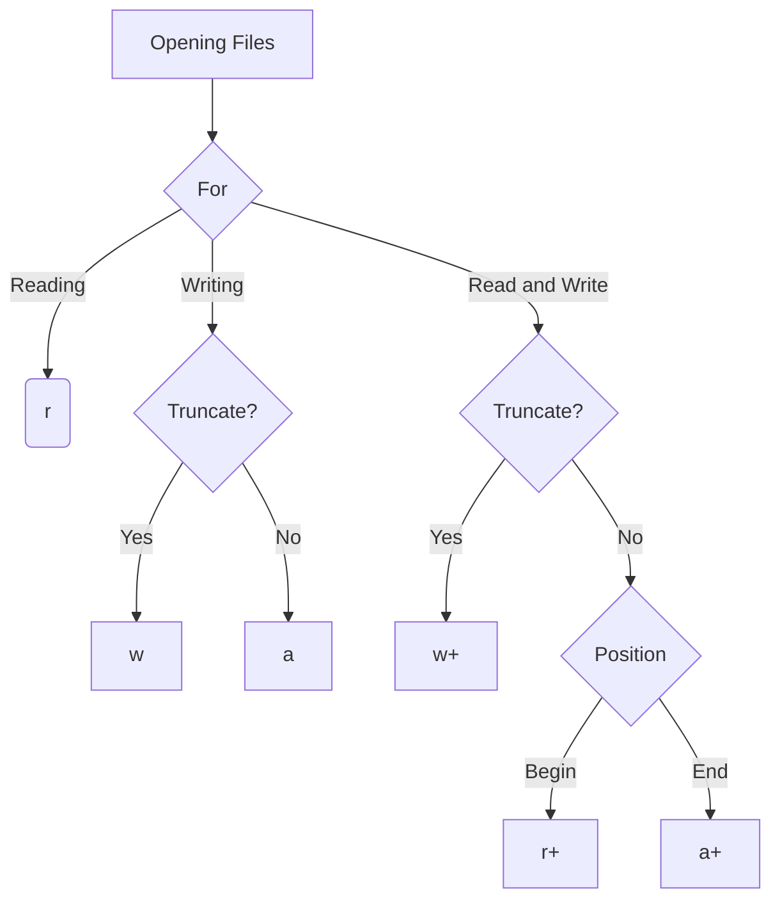

# Files and exceptions in Pyhon

<details>
<summary>Teacher Notes</summary>

- Files
- Exceptions

</details>

## Memory architecture

 [source](https://linux2me.wordpress.com/2017/09/15/linux-introduction-to-memory-management/)

This is not a class of computer architecture, but it is important to understand how data is stored and works in a computer. Four our intent, we will focus only on the file system and the memory.

When we talk about files, we are talking about the data stored in a permanent way in the computer. So files are non-volatile memory. This means that the data is stored in a way that it will not be lost when the computer is turned off. This category of storage is called secondary storage and it is cheap and usually big.

But when we talk about memory, it usully refers to the RAM memory. A volatile memory when the computer is turned off, the data is lost. This memory is fast and expensive. It is used to store data that is being processed by the CPU. 

It is pretty common we face some files that are too big to be processed in memory. So we need to process them in chunks. This is called streaming.

## Opening files

You can open the file for read, write, or append. Or you can combine them. 

``` python
# open file for reading
f = open('file.txt', 'r')
```

You can replace the `r` with other letters to open the file in different modes:

- `r` - read
- `w` - write
- `a` - append



::: note "Binary mode"

You can also open the file in binary mode by adding a `b` to the mode. For example, `rb` for read binary, `wb` for write binary, and `ab` for append binary.

:::

## Isolating contexts in handles

``` python
# creates f handle, and closes when the scope ends
with open('file.txt', 'r') as f:
    data = f.read() # read the whole file at once and consume memory
# f variable exists here but it is guaranteed to be closed
print(f.closed) # returns True 
```

 [source](https://imgflip.com/i/47p0ts)

## Useful methods

| Method | Description                                                                    |
|--------|--------------------------------------------------------------------------------|
| `close()` | Closes the file handle and no longer allows access to the file.  |
| `read()` | Reads the whole file at once and consumes memory                               |
| `read(n)` | Reads n bytes from the file                                                    |
| `readline()` | Reads one line from the file. It will capture even the newline character       |
| `readlines()` | Reads all lines from the file and returns a list                               |
| `write(string)` | Writes a string to the file                                                    |
| `writelines(list)` | Writes a list of strings to the file                                           |
| `tell()` | Returns the current byte position in the file                                  |
| `seek(offset)` | Moves the file pointer to a new position in the file, relative to the beginning of the file. |
| `seek(offset, whence)` | `whence` can be `0` (beginning), `1` (current position), or `2` (end of file). |
| `flush()` | Flushes the internal buffer to the file                                         |

## Examples

### Copying a file

``` python
# copy a file chunk by chunck to avoid memory issues
with open('file.txt', 'rb') as orig:
    with open('copy.txt', 'wb') as dest:
        while True:
            chunk = orig.read(1024) # read 1KB at a time
            if not chunk: # if there is no more data to read
                break
            dest.write(chunk) # write the chunk to the destination file
```

!!! code
{
"description": "Write a program that 1. write in binary mode exactly these bytes: 0x48, 0x65, 0x6c, 0x6c, 0x6f, 0x20, 0x57, 0x6f, 0x72, 0x6c, 0x64. 2. And then read one line of the file and print the content.",
"code": "contents = bytes([0x48, 0x65, 0x6c, 0x6c, 0x6f, 0x20, 0x57, 0x6f, 0x72, 0x6c, 0x64])\n# write the contents as binary to a file contents.txt\n\n# code here\n\n# read one line string of the contents.txt and print it\n\n# code here",
"language": "python",
"expectedOutput": "Hello World"
}
!!!

## Exceptions

Exceptions are errors that occur during the execution of a program. It is a good practice to gracefully handle exceptions to avoid crashing the program.

 [source](https://www.reddit.com/r/ProgrammerHumor/comments/eztdu6/me_handling_exception_in_best_way/#lightbox)

The syntax for handling exceptions is as follows:

``` python
try:
    # code that may raise an exception
except ExceptionType as e:
    # code to handle the exception filtered by type
except Exception as e:
    # code to handle any other exception not filtered before
else:
    # code to run if no exception was raised
finally:
    # code to run regardless of whether an exception was raised or not
```

Error handling are particularly useful when dealing with files, as they can fail for various reasons, such as file not found, permission denied, etc.

``` python
data = None
try:
    with open('file.txt', 'r') as f:
        data = f.read()
except FileNotFoundError as e:
    print(f'File not found: {e}')
except PermissionError as e:
    print(f'Permission denied: {e}')
except Exception as e:
    print(f'An error occurred: {e}')
else:
    print('File read successfully')
finally:
    print('Done')
```